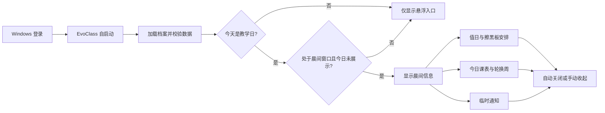
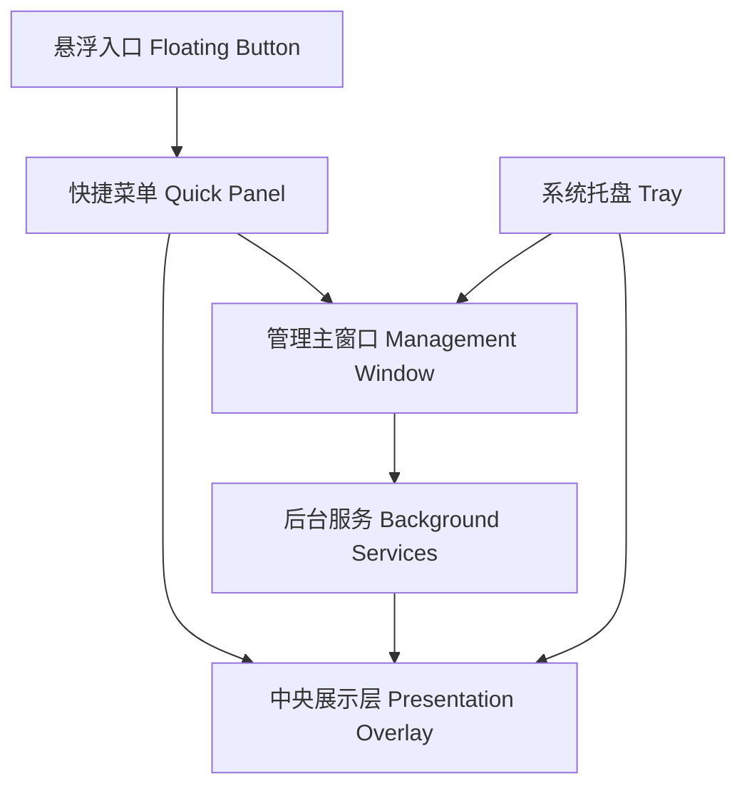
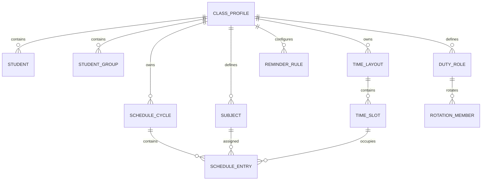
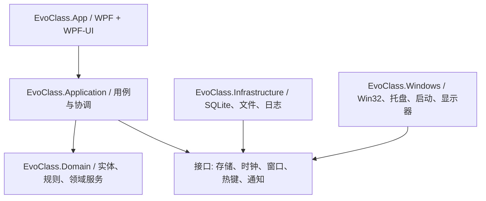
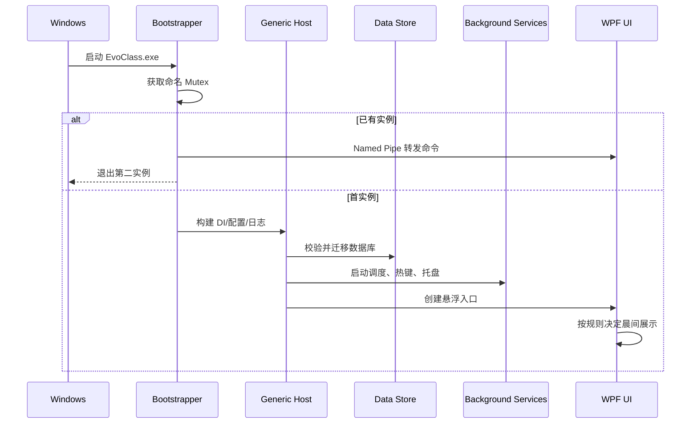
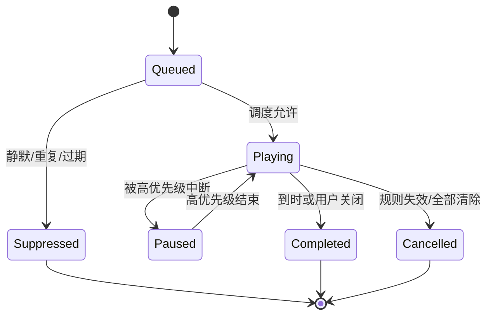

# EvoClass 产品技术规格书

> 项目代号：EvoClass（暂定）  
> 文档类型：PRD + 技术设计 + 开发准备  
> 目标平台：Windows 10 / Windows 11  
> UI 技术：C#、WPF、WPF-UI  
> 文档版本：0.1  
> 编写日期：2026-08-08

---

## 1. 文档结论

EvoClass 是一款面向中小学教室多媒体电脑的离线优先桌面工具。它常驻 Windows 桌面，通过左侧悬浮入口、屏幕中央展示层和完整管理主窗口，提供晨间信息、课程表、值日与擦黑板安排、课间提醒、随机抽人、快捷键和紧急窗口关闭等能力。

产品借鉴 ClassIsland 的以下方法：

1. 以常驻、低干扰的信息界面服务课堂，而不是要求用户频繁打开传统软件窗口。
2. 将科目、作息时间和课程表分离，支持多周轮换和临时覆盖。
3. 使用组件化展示、分级提醒和“触发条件 -> 行动”的自动化思路。
4. 将复杂配置放在管理窗口，把课堂高频操作压缩到一步或两步。

本项目不复制 ClassIsland 的源码、名称、图标、素材或界面细节。ClassIsland 当前仓库采用 GPL-3.0；若直接复制或修改其代码，会引入 GPL 衍生作品义务。本项目应保持独立设计与独立实现，只参考公开产品行为和通用交互模式。

### 1.1 技术基线建议

截至 2026-08-08，微软官方发布元数据显示 .NET 8 和 .NET 9 均将在 2026-11-10 结束支持，而 .NET 10 是支持至 2028-11-14 的 LTS 版本。因此：

- 推荐正式项目使用 `net10.0-windows10.0.19041.0`。
- 如果必须严格限定在 .NET 8/9，MVP 使用 `net8.0-windows10.0.19041.0`，并在正式发布前升级到 .NET 10。
- 不建议新项目选择 .NET 9；它没有给当前项目带来足以抵消升级成本的收益。

WPF-UI 仍作为指定 UI 框架使用。文档后续架构不依赖 .NET 10 独占 API，因此从 .NET 8 升级的迁移成本可控。

---

## 2. ClassIsland 调研摘要

### 2.1 公开产品定位

ClassIsland 将自己定位为班级多媒体屏幕上的课表信息显示工具。公开功能包括：

- 显示当天课表、当前课程和课程进度。
- 上下课与重要时间点提醒，支持音效、语音、遮罩和置顶效果。
- 科目、时间表、课表分离编辑，多周轮换与临时换课。
- 通过组件自定义日期、时间、天气、倒计时等展示内容。
- 通过自动化在应用启动、上下课、课间、放学、特定时间点或前台窗口变化时执行行动。
- 根据全屏、最大化窗口、焦点进程等条件隐藏或改变主界面。
- 档案导入导出、插件扩展、主题与本地配置。

### 2.2 当前技术形态

ClassIsland 最新主线已从传统 Windows 单平台方向扩展为 .NET 8 + Avalonia 的跨平台项目，并拆分出 Core、Shared、Desktop、PluginSdk、IPC 等多个工程。它的主界面是无边框透明常驻窗口，设置窗口和档案编辑器与主展示界面分离。

EvoClass 不需要沿用这套跨平台复杂度。目标平台只有 Windows 10/11，采用 WPF 可以更直接地使用：

- Windows 全局热键、窗口枚举和进程管理。
- 系统托盘、开机启动、DPI 与多显示器 API。
- WPF-UI 的 Fluent Design、NavigationView、Snackbar、ContentDialog 和主题支持。
- DWM、Mica、Acrylic 与窗口消息。

### 2.3 值得继承的产品原则

| 原则 | 对 EvoClass 的落地 |
| --- | --- |
| 主展示与管理配置分离 | 悬浮入口/中央展示层负责课堂操作，主窗口负责编辑配置 |
| 课表数据分层 | 科目、作息、课程方案、日期覆盖分别建模 |
| 临时变化优先于永久修改 | 临时换课、临时值日替换只生成日期覆盖，不污染基础规则 |
| 提醒有优先级和队列 | 避免多个提醒叠加、抢焦点或重复播报 |
| 自动化基于领域事件 | 使用上课、下课、课间、启动等明确事件，不依赖页面定时器 |
| 常驻但低干扰 | 支持自动隐藏、透明度、置顶策略、拖动吸边和演示模式 |

### 2.4 不应在 MVP 复制的复杂度

- 插件市场和第三方插件加载。
- 跨平台抽象层。
- 网络集控、账号系统和云同步。
- 任意脚本执行或完整通用自动化编辑器。
- 天气、在线 TTS、远程管理等非核心功能。

---

## 3. 产品定义

### 3.1 产品愿景

让教室电脑在每天开机后自动成为清晰、可靠、低打扰的班级信息助手，并让教师在课堂中用最少操作完成常用辅助动作。

### 3.2 目标用户

| 用户 | 主要任务 | 使用频率 |
| --- | --- | --- |
| 班主任/管理员 | 录入学生、课程、排班、提醒和快捷键 | 每周或按学期 |
| 任课教师 | 查看当前课、随机抽人、显示值日安排、关闭干扰窗口 | 每节课 |
| 学生 | 晨间查看课程和值日信息、课间接收提醒 | 每天 |
| 信息技术管理员 | 安装、升级、备份、故障恢复 | 低频 |

### 3.3 核心目标

- 开机后 5 秒内进入可用常驻状态。
- 教师无需进入主设置窗口即可完成高频操作。
- 周轮换、组轮换和临时替换能被准确计算并清楚解释。
- 自动提醒不抢占课件焦点，不影响触控白板和演示软件。
- 所有核心功能在无网络环境下可用。
- 数据可备份、迁移和恢复，异常断电后不损坏核心配置。

### 3.4 非目标

- 不承担正式教务排课系统职责。
- 不记录成绩、考勤、健康等敏感教育数据。
- 不在 MVP 中提供人脸识别、摄像头点名或联网监控。
- 不替代 Windows 任务管理器，也不结束系统服务或关键系统进程。
- 不保证与 ClassIsland 配置文件或插件兼容。

---

## 4. 版本范围

### 4.1 MVP / 0.1

必须交付：

- 首次启动向导。
- 学生、分组、科目、作息和课程表编辑。
- 单周与多周轮换课程表。
- 值日生、擦黑板等自定义岗位的周轮换/组轮换。
- 日期级临时换课和临时人员替换。
- 晨间信息展示。
- 左侧悬浮按钮、快捷菜单、拖动吸边和位置记忆。
- 中央展示层：值日安排、今日课表、当前课程、随机抽人。
- 全局快捷键。
- 课前/课间/放学提醒。
- 系统托盘、单实例、可选开机启动。
- 救援系统：关闭前台窗口、查看当前显示器窗口、受控强制结束。
- 本地备份、导入和导出。

### 4.2 0.2

- 更完整的触发器/条件/行动自动化编辑器。
- Excel/CSES 课表导入。
- 多套班级档案快速切换。
- 自定义中央展示组件和主题方案。
- 提醒音效库、Windows 本地 TTS。
- 自动更新。

### 4.3 1.0 以后

- 校内局域网集控。
- 权限与设置密码。
- 插件 SDK。
- 云端同步、在线通知和天气等可选能力。

---

## 5. 核心使用流程

### 5.1 首次配置

1. 用户选择班级名称和学期起止日期。
2. 录入或粘贴学生名单，并建立小组。
3. 创建科目。
4. 创建作息时间表，例如早读、第一节、课间、午休。
5. 选择单周、单双周或 N 周课程轮换。
6. 配置值日岗位和轮换规则。
7. 配置晨间展示时段、提醒和全局快捷键。
8. 预览今天的计算结果，确认后启用常驻模式。

### 5.2 每日晨间



### 5.3 课堂随机抽人

1. 教师点击悬浮按钮或按全局快捷键。
2. 点击“随机抽人”。
3. 中央展示层显示滚动动画，动画不参与随机结果计算。
4. 展示最终姓名、所属小组和本轮剩余人数。
5. 教师可选择“再抽一人”“标记缺席”“结束”。
6. 抽取记录写入本地历史；默认采用洗牌袋策略，未抽完一轮前不重复。

### 5.4 课间值日提醒

1. 调度器发现进入指定课间或到达自定义时间点。
2. 生成值日提醒请求。
3. 提醒协调器去重并检查静默、演示、全屏和优先级策略。
4. 在不抢焦点的中央展示层显示人员和任务。
5. 到时自动关闭；用户可从悬浮入口再次打开。

### 5.5 救援系统

救援系统解决课件、浏览器、视频或其他程序遮挡课堂且难以及时关闭的问题。

提供两级动作：

1. **快速关闭前台窗口**：向当前前台顶层窗口发送 `WM_CLOSE`，等价于点击窗口关闭按钮，不直接终止进程。
2. **救援中心**：列出当前显示器上可见的普通应用窗口，允许逐个优雅关闭；等待超时后，用户可明确确认“强制结束进程”。

保护规则：

- 永不结束 EvoClass 自身、`explorer.exe`、`dwm.exe`、`winlogon.exe`、`csrss.exe`、`lsass.exe`、`services.exe`、`svchost.exe` 等系统关键进程。
- 默认不显示无标题窗口、工具窗口、后台进程和不在当前显示器可视区域内的窗口。
- 不主动提权；无法操作的管理员窗口显示“权限不足”。
- 强制结束前展示进程名、窗口标题和未保存内容风险，并要求二次确认。
- 所有动作记录本地审计日志，记录时间、目标进程和结果，不记录窗口内容。

---

## 6. 信息架构与界面

### 6.1 四个运行界面



#### A. 悬浮入口

- 默认位于主显示器左侧中部，直径建议 52-60 DIP。
- 支持纵向拖动、靠边吸附、多显示器迁移和每显示器位置记忆。
- 单击展开快捷菜单；拖动不触发单击。
- 长时间无操作时降低透明度；鼠标或触摸靠近时恢复。
- 不显示任务栏按钮，不抢占键盘焦点。
- 可设置仅课间显示、始终显示、自动隐藏或完全关闭。

#### B. 快捷菜单

建议为靠近悬浮按钮的纵向工具面板，不使用复杂径向菜单，以保证触控大屏上的可发现性和命中率。

默认动作：

- 显示值日生。
- 随机抽人。
- 查看当前课程/今日课表。
- 打开救援中心。
- 打开主窗口。

菜单项允许排序、隐藏和绑定快捷键。单项触控目标不小于 44 x 44 DIP。

#### C. 中央展示层

- 出现在触发操作所在显示器的工作区中央。
- 手动打开时可获取焦点；自动提醒时默认不激活窗口。
- 内容使用高对比大字号，适合教室后排阅读。
- `Esc` 关闭；自动提醒有明确倒计时或进度提示。
- 普通信息窗口建议宽 680-820 DIP；随机抽人建议宽 900-1000 DIP。
- 不用嵌套卡片。标题、主信息、辅助信息和操作区采用清晰分区。
- Windows 11 使用 Mica/半透明材质；Windows 10 自动回退为不透明 Fluent 背景。

#### D. 管理主窗口

使用 WPF-UI `FluentWindow + NavigationView`，建议导航结构：

1. 概览。
2. 今日与课程表。
3. 学生与小组。
4. 值日与岗位。
5. 提醒与自动化。
6. 快捷操作与热键。
7. 外观与窗口。
8. 系统与启动。
9. 数据、日志与关于。

### 6.2 关键页面规格

#### 概览页

- 当前日期、教学周、轮换周和当前时间状态。
- 当前课、下一节课、今日课程。
- 今日岗位安排。
- 最近提醒和数据异常提示。
- “预览晨间信息”“临时换课”“临时替换人员”快捷命令。

#### 课程表页

- 周视图表格，横轴星期，纵轴作息时间段。
- 顶部使用分段控件切换第 1/N 周。
- 单元格点击选择科目；支持复制、粘贴和清空。
- 临时覆盖使用明显但克制的标记，并显示生效日期。
- 冲突、缺失科目和不合法时间段即时校验。

#### 值日与岗位页

- 左侧岗位列表，例如值日、擦黑板、关灯、讲台整理。
- 中间轮换规则和人员/小组队列。
- 右侧未来 2-4 周预览。
- 支持跳过节假日、仅教学日、按周或按教学日推进。
- 临时替换不改变基础队列。

#### 学生与小组页

- 名单支持批量粘贴，每行一个姓名，重复项需确认。
- 支持学号/座号、姓名、小组、启用状态。
- 缺席为临时状态，可设置至当天结束或指定日期。
- 删除学生前检查其在排班和随机历史中的引用。

#### 提醒页

- 使用“触发时机、提醒内容、展示方式”三段式编辑。
- 预置课前提醒、下课提醒、课间值日、放学提醒。
- 支持提前秒数、持续时间、声音、语音和优先级。
- 提供即时预览，不需要等待真实时间点。

#### 系统页

- 开机启动。
- 启动后仅托盘运行。
- 单实例与异常恢复状态。
- 数据目录、备份与日志入口。
- Windows 版本、运行时、应用版本和更新通道。

---

## 7. 功能需求

优先级定义：P0 为 MVP 必须，P1 为首个稳定版，P2 为后续增强。

### 7.1 应用生命周期

| ID | 优先级 | 需求 | 验收要点 |
| --- | --- | --- | --- |
| APP-001 | P0 | 应用只允许一个实例 | 第二实例把命令转发给首实例后退出 |
| APP-002 | P0 | 支持托盘常驻 | 关闭管理窗口不退出后台服务 |
| APP-003 | P0 | 支持正常退出和重启 | 退出前保存配置并释放热键、托盘和互斥锁 |
| APP-004 | P0 | 异常退出恢复 | 下次启动提示恢复并保留最近有效数据 |
| APP-005 | P0 | 可选开机启动 | 用户级设置，无需管理员权限 |
| APP-006 | P1 | 自动更新 | 支持稳定/预览通道和失败回滚 |

### 7.2 悬浮入口与快捷操作

| ID | 优先级 | 需求 | 验收要点 |
| --- | --- | --- | --- |
| FLT-001 | P0 | 左侧悬浮按钮 | 默认左侧、置顶、无任务栏图标 |
| FLT-002 | P0 | 拖动与吸边 | DPI/多屏下位置正确，不超出工作区 |
| FLT-003 | P0 | 快捷菜单 | 500 ms 内展开，不打开主窗口即可执行核心动作 |
| FLT-004 | P0 | 位置和透明度记忆 | 重启后按显示器恢复 |
| FLT-005 | P1 | 显示规则 | 可按上课/课间/全屏窗口状态自动显示或隐藏 |
| FLT-006 | P1 | 触摸优化 | 触摸与鼠标都可可靠区分点击和拖动 |

### 7.3 热键

| ID | 优先级 | 需求 | 验收要点 |
| --- | --- | --- | --- |
| HOT-001 | P0 | 注册全局快捷键 | 应用无焦点时仍可触发 |
| HOT-002 | P0 | 冲突检测 | 注册失败时指出冲突并允许修改 |
| HOT-003 | P0 | 可配置动作 | 值日、随机、课程、救援、显示/隐藏入口 |
| HOT-004 | P1 | 安全限制 | 禁止仅使用单个字母、数字或系统保留组合 |

### 7.4 课程与时间

| ID | 优先级 | 需求 | 验收要点 |
| --- | --- | --- | --- |
| SCH-001 | P0 | 科目管理 | 名称、简称、颜色、启用状态 |
| SCH-002 | P0 | 作息时间表 | 时间段不重叠，支持课程、课间、早读、午休等类型 |
| SCH-003 | P0 | 周课程表 | 支持周一至周日和任意时间段 |
| SCH-004 | P0 | N 周轮换 | N 为 1-8，基于锚点日期稳定计算 |
| SCH-005 | P0 | 当前/下一课程 | 系统时间变化、休眠恢复后结果正确 |
| SCH-006 | P0 | 日期临时覆盖 | 临时换课只影响指定日期 |
| SCH-007 | P1 | 节假日与特殊教学日 | 可将周末标记为教学日或工作日标记为休息日 |
| SCH-008 | P1 | 导入导出 | Excel/CSES 导入，提供映射和预览 |

### 7.5 岗位与轮换

| ID | 优先级 | 需求 | 验收要点 |
| --- | --- | --- | --- |
| DUT-001 | P0 | 自定义岗位 | 至少支持值日、擦黑板，允许新增 |
| DUT-002 | P0 | 人员轮换 | 按个人队列轮换，可配置每次人数 |
| DUT-003 | P0 | 小组轮换 | 按小组轮换，可显示组内成员 |
| DUT-004 | P0 | 周轮换 | 每自然周或教学周推进一次 |
| DUT-005 | P0 | 日期轮换 | 每个教学日推进一次，自动跳过非教学日 |
| DUT-006 | P0 | 临时替换 | 替换结果仅对指定日期生效 |
| DUT-007 | P0 | 未来预览 | 可预览至少未来 4 周并解释计算依据 |
| DUT-008 | P1 | 公平统计 | 显示周期内每人的安排次数和异常偏差 |

### 7.6 晨间信息

| ID | 优先级 | 需求 | 验收要点 |
| --- | --- | --- | --- |
| BRF-001 | P0 | 每日展示 | 教学日晨间时段内每天最多自动展示一次 |
| BRF-002 | P0 | 内容组合 | 日期、轮换周、岗位、今日课程 |
| BRF-003 | P0 | 手动重开 | 可随时从快捷菜单重新打开 |
| BRF-004 | P1 | 临时公告 | 支持开始/结束日期和优先级 |
| BRF-005 | P1 | 组件排序 | 用户可调整内容顺序和可见性 |

### 7.7 随机抽人

| ID | 优先级 | 需求 | 验收要点 |
| --- | --- | --- | --- |
| RND-001 | P0 | 单人抽取 | 结果在动画开始前已确定，动画不改变结果 |
| RND-002 | P0 | 无放回模式 | 当前轮未完成前不重复 |
| RND-003 | P0 | 缺席排除 | 缺席或停用学生不进入候选集 |
| RND-004 | P0 | 多人/按组抽取 | 数量超过候选人数时明确提示 |
| RND-005 | P0 | 历史记录 | 记录时间、模式、候选范围和结果 |
| RND-006 | P1 | 权重模式 | 可选，默认关闭并清楚显示非等概率状态 |
| RND-007 | P1 | 本轮重置 | 可手动开始新一轮并记录重置时间 |

### 7.8 提醒

| ID | 优先级 | 需求 | 验收要点 |
| --- | --- | --- | --- |
| NTF-001 | P0 | 时间点提醒 | 可绑定课程开始、结束、课间和自定义时间 |
| NTF-002 | P0 | 优先级和队列 | 高优先级可中断低优先级，普通提醒顺序播放 |
| NTF-003 | P0 | 防重复 | 同一事件在容错窗口内只触发一次 |
| NTF-004 | P0 | 不抢焦点 | 自动提醒不打断课件键盘输入 |
| NTF-005 | P0 | 预览 | 设置页可即时测试视觉、声音和持续时间 |
| NTF-006 | P1 | 本地语音 | 使用 Windows 语音能力，失败时退化为文本 |
| NTF-007 | P1 | 全屏策略 | 可选择不显示、安静显示或正常显示 |

### 7.9 救援系统

| ID | 优先级 | 需求 | 验收要点 |
| --- | --- | --- | --- |
| RSC-001 | P0 | 快速关闭前台窗口 | 只发送 `WM_CLOSE`，不直接杀进程 |
| RSC-002 | P0 | 当前屏幕窗口列表 | 只显示用户可识别的可见顶层窗口 |
| RSC-003 | P0 | 受保护进程列表 | 关键系统进程和自身不可被操作 |
| RSC-004 | P0 | 强制结束确认 | 明确显示未保存内容风险和目标信息 |
| RSC-005 | P0 | 权限失败处理 | 不崩溃、不循环提权，给出可理解结果 |
| RSC-006 | P0 | 本地审计记录 | 记录目标、动作、结果和时间 |
| RSC-007 | P1 | 进程白名单/黑名单 | 管理员可配置普通应用保护或快捷关闭名单 |

### 7.10 数据与设置

| ID | 优先级 | 需求 | 验收要点 |
| --- | --- | --- | --- |
| DAT-001 | P0 | 自动保存 | 编辑提交后事务保存，异常不留下半成品 |
| DAT-002 | P0 | 自动备份 | 每日首次有效修改后备份，保留最近 7-14 份 |
| DAT-003 | P0 | 手动导出 | 生成单一备份包，包含版本和校验信息 |
| DAT-004 | P0 | 导入预检 | 导入前显示班级、记录数、版本和冲突 |
| DAT-005 | P0 | 数据迁移 | 数据库升级使用显式迁移，失败可回滚 |
| DAT-006 | P1 | 设置锁 | 密码保护课程、名单和系统设置 |

---

## 8. 领域模型

### 8.1 核心实体

| 实体 | 关键字段 | 说明 |
| --- | --- | --- |
| `ClassProfile` | Id, Name, TermStart, TermEnd, TimeZoneId | 一套班级档案 |
| `Student` | Id, Number, Name, GroupId, IsEnabled | 学生基础信息 |
| `StudentGroup` | Id, Name, SortOrder | 学习小组/值日小组 |
| `Subject` | Id, Name, ShortName, Color | 科目 |
| `TimeLayout` | Id, Name | 一套作息 |
| `TimeSlot` | Id, LayoutId, Type, Start, End, SortOrder | 课程或课间时间点 |
| `ScheduleCycle` | Id, Name, WeekCount, AnchorDate | N 周课程轮换定义 |
| `ScheduleEntry` | CycleWeek, DayOfWeek, TimeSlotId, SubjectId | 基础课表项 |
| `CalendarOverride` | Date, DayType, ScheduleCycleWeek? | 节假日、调休和临时周覆盖 |
| `ScheduleOverride` | Date, TimeSlotId, SubjectId? | 日期级换课/停课 |
| `DutyRole` | Id, Name, AssigneeType, PeoplePerTurn | 值日岗位 |
| `RotationPolicy` | Unit, Interval, AnchorDate, SkipNonSchoolDays | 轮换规则 |
| `RotationMember` | RoleId, StudentId/GroupId, Order | 轮换队列 |
| `DutyOverride` | Date, RoleId, AssigneeIds | 日期级替换 |
| `ReminderRule` | Trigger, Offset, Priority, Presentation | 提醒规则 |
| `HotkeyBinding` | ActionId, Modifiers, Key | 全局热键 |
| `RandomBagState` | ScopeId, RemainingIds, Round | 无放回抽取状态 |
| `ActionAudit` | Time, ActionType, Target, Result | 救援等敏感动作记录 |

### 8.2 关系示意



### 8.3 轮换计算

#### 周课程轮换

```text
days = date.Date - anchorDate.Date
weekOffset = floor(days.TotalDays / 7)
cycleWeek = positiveModulo(weekOffset, weekCount) + 1
```

规则：

- `anchorDate` 必须是某个轮换周期第 1 周的周一。
- 日期早于锚点时仍使用正模运算，保证结果稳定。
- `CalendarOverride.ScheduleCycleWeek` 可覆盖特殊日期的轮换周。
- 学期变更不隐式修改旧锚点；向导应提供“从新学期首周重新开始”的显式选项。

#### 按教学日轮换

```text
teachingDayIndex = countTeachingDays(anchorDate, targetDate)
turnIndex = floor(teachingDayIndex / interval) mod memberCount
```

计算教学日时必须读取校历覆盖，不能简单排除周六和周日。为避免每次从锚点逐日扫描，持久层可缓存每学期的教学日序列，校历变化后重建缓存。

#### 按周轮换

```text
weekIndex = floor((startOfWeek(targetDate) - startOfWeek(anchorDate)).TotalDays / 7)
turnIndex = floor(weekIndex / interval) mod memberCount
```

#### 临时覆盖优先级

```text
日期级临时覆盖 > 校历覆盖 > 基础轮换规则 > 默认值
```

所有预览界面都应显示“为什么今天是这组/这些人”，包括锚点、周期、序号和覆盖来源，降低排班争议。

### 8.4 随机抽人算法

默认使用 Fisher-Yates 洗牌生成候选顺序，并持久化剩余队列：

1. 候选集由启用学生减去当天缺席学生得到。
2. 新一轮开始时复制候选 ID 并洗牌。
3. 每次从队尾取出一个 ID。
4. 候选集发生变化时，保留仍有效的剩余 ID，新加入人员插入并重新洗牌未抽部分。
5. 一轮耗尽后自动开始下一轮，并增加 `Round`。

视觉滚动只消费候选名称副本，不参与实际随机数生成，避免动画帧率影响结果。

---

## 9. 技术架构

### 9.1 总体架构

采用模块化单体和清晰分层，不在 MVP 引入插件微内核。



依赖规则：

- Domain 不引用 WPF、数据库、Win32 或具体日志框架。
- Application 只引用 Domain 和抽象接口。
- App 负责视图、ViewModel、导航和窗口生命周期。
- Infrastructure 与 Windows 实现 Application 所需接口。
- UI 不直接执行 SQL、P/Invoke 或进程终止。

### 9.2 建议解决方案结构

```text
EvoClass.sln
src/
  EvoClass.App/                    # WPF 启动项目、Views、ViewModels、Resources
  EvoClass.Application/            # 用例、DTO、调度协调、接口
  EvoClass.Domain/                 # 实体、值对象、轮换和课表规则
  EvoClass.Infrastructure/         # EF Core SQLite、JSON 设置、备份、日志
  EvoClass.Windows/                # Win32、热键、托盘、启动、多屏、进程窗口
tests/
  EvoClass.Domain.Tests/           # 轮换、课程状态、随机抽取
  EvoClass.Application.Tests/      # 用例与调度测试
  EvoClass.Infrastructure.Tests/   # 数据迁移、备份恢复
  EvoClass.Ui.Tests/               # 关键窗口冒烟测试
build/
  publish.ps1
  installer/
docs/
```

如果初始团队只有一名开发者，可以先合并 `Infrastructure` 与 `Windows`，但不得把其代码放入 ViewModel。

### 9.3 主要技术组件

| 领域 | 建议 | 说明 |
| --- | --- | --- |
| UI | WPF + WPF-UI 4.x | FluentWindow、NavigationView、ContentDialog、Snackbar |
| MVVM | CommunityToolkit.Mvvm | 源生成属性与命令，减少样板代码 |
| DI/Host | Microsoft.Extensions.Hosting | 服务注册、生命周期、配置和日志 |
| 数据库 | EF Core + SQLite | 结构化数据、事务和迁移 |
| 设置 | `System.Text.Json` | 窗口位置、主题、设备级偏好 |
| 日志 | Microsoft.Extensions.Logging + Serilog | 滚动本地文件，结构化事件 |
| 托盘 | H.NotifyIcon.Wpf 或 WPF-UI 已验证的托盘能力 | 选定后只保留一种实现 |
| 测试 | xUnit + FluentAssertions | 领域和应用层测试 |
| Mock | NSubstitute 或 Moq | 项目统一一种 |
| 打包更新 | Velopack 或 WiX Toolset | MVP 可先用 WiX/Inno Setup，稳定版增加更新 |

依赖版本应通过中央包管理 `Directory.Packages.props` 固定，禁止在各项目中散落版本号。

### 9.4 应用启动顺序



### 9.5 关键服务接口

```csharp
public interface ISchoolCalendarService
{
    bool IsTeachingDay(DateOnly date);
    int GetTeachingDayIndex(DateOnly anchor, DateOnly date);
}

public interface IScheduleResolver
{
    DaySchedule Resolve(DateOnly date, DateTimeOffset now);
}

public interface IRotationEngine
{
    RotationResult Resolve(RotationPolicy policy, DateOnly date);
}

public interface IReminderCoordinator
{
    Task EnqueueAsync(ReminderRequest request, CancellationToken cancellationToken);
}

public interface IGlobalHotkeyService
{
    HotkeyRegistrationResult Register(HotkeyBinding binding);
    void UnregisterAll();
}

public interface IRescueService
{
    Task<CloseWindowResult> TryCloseForegroundWindowAsync(CancellationToken cancellationToken);
    IReadOnlyList<VisibleAppWindow> GetVisibleWindowsOnMonitor(nint monitorHandle);
    Task<TerminateProcessResult> TerminateConfirmedAsync(int processId, CancellationToken cancellationToken);
}
```

接口使用 `DateOnly`、`TimeOnly` 和 `DateTimeOffset`，禁止在领域层直接读取 `DateTime.Now`。统一通过 `TimeProvider` 或 `IClock` 注入时间，以便测试跨日、休眠恢复和时钟调整。

---

## 10. Windows 集成设计

### 10.1 单实例与命令转发

- 使用带用户 SID 的命名 `Mutex`，避免不同 Windows 用户互相影响。
- 第二实例通过 Named Pipe 发送 `ShowMainWindow`、`ShowDuty`、`RandomPick` 等命令。
- 首实例应验证消息结构和最大长度，不接受任意命令行执行。

### 10.2 全局热键

- 使用 Win32 `RegisterHotKey` / `UnregisterHotKey`。
- 由隐藏消息窗口统一接收 `WM_HOTKEY`。
- 配置修改采用“先注册新组合，成功后释放旧组合”，避免保存后失去可用热键。
- 推荐默认组合：
  - `Ctrl+Alt+D`：值日安排。
  - `Ctrl+Alt+R`：随机抽人。
  - `Ctrl+Alt+C`：当前课程。
  - `Ctrl+Alt+Esc`：救援中心。

### 10.3 开机启动

未打包的桌面 EXE 使用当前用户注册表：

```text
HKCU\Software\Microsoft\Windows\CurrentVersion\Run
```

值必须包含带引号的绝对路径和 `--autostart` 参数。启动状态应在每次打开系统页时重新读取，而不是只相信本地设置。卸载程序必须清理该项。

### 10.4 悬浮窗口

- `WindowStyle=None`、`ResizeMode=NoResize`、`ShowInTaskbar=false`。
- 添加 `WS_EX_TOOLWINDOW`，按需要添加 `WS_EX_NOACTIVATE`。
- 小尺寸悬浮窗口可使用 `AllowsTransparency=true`；大型中央展示层不要依赖大面积逐像素透明，以免 WPF 软件渲染和性能下降。
- 通过 `MonitorFromPoint`、`GetMonitorInfo` 获取工作区，避免遮挡任务栏。
- 应用声明 Per-Monitor V2 DPI 感知；保存位置使用 DIP + 显示器设备标识，不直接持久化裸像素。

### 10.5 中央展示层

- 自动提醒窗口使用 `ShowActivated=false` 和无激活显示策略。
- 手动随机抽人和救援中心允许激活，以支持键盘操作。
- 多屏选择顺序：触发悬浮按钮所在屏幕 > 当前前台窗口所在屏幕 > 主屏幕。
- 屏幕分辨率变化、投影模式变化和 DPI 变化时重新约束窗口边界。

### 10.6 前台与可见窗口识别

救援中心建议使用：

- `GetForegroundWindow` 获取前台窗口。
- `EnumWindows` 枚举顶层窗口。
- `IsWindowVisible`、`GetWindowTextLength` 和扩展窗口样式过滤普通应用窗口。
- `DwmGetWindowAttribute(DWMWA_CLOAKED)` 排除被系统隐藏的窗口。
- `GetWindowRect` 与显示器工作区求交，判断是否显示在目标屏幕。
- `GetWindowThreadProcessId` 获取进程。
- `SendMessageTimeout(WM_CLOSE)` 优雅关闭，避免目标窗口无响应拖住本应用。

强制终止使用 `Process.Kill(entireProcessTree: false)`，不默认结束进程树。浏览器等多进程应用可能只关闭目标窗口所属进程，因此 UI 应准确描述行为，不承诺“一键清空屏幕上所有程序”。

### 10.7 休眠、时间与系统事件

- 监听系统恢复、时间变化、时区变化、会话解锁和显示器变化。
- 恢复后立即重新计算当前课程和未来提醒。
- 不补播已经过期太久的普通提醒；建议容错窗口为 30-90 秒。
- 高优先级事件是否补播由规则单独配置。

---

## 11. 调度与提醒架构

### 11.1 原则

- 不使用页面 `DispatcherTimer` 承担业务调度。
- 后台服务根据领域数据计算下一个时间点，并设置可取消等待。
- 每隔 30 秒执行一次轻量对账，用于处理系统时钟跳变或漏失事件。
- 所有触发生成领域事件，再由提醒、日志或自动化消费者处理。

### 11.2 领域事件

```text
ApplicationStarted
TeachingDayStarted
MorningBriefingWindowEntered
TimeSlotStarting
TimeSlotStarted
TimeSlotEnding
TimeSlotEnded
BreakStarted
AfterSchoolStarted
ScheduleChanged
DutyAssignmentChanged
ForegroundWindowChanged     # P1
```

### 11.3 提醒状态机



提醒请求至少包含：唯一事件键、优先级、创建时间、过期时间、展示模板、文本、声音、是否允许抢占、显示器策略和自动关闭时长。

---

## 12. 数据存储与备份

### 12.1 目录

建议使用：

```text
%LocalAppData%\EvoClass\
  data\evoclass.db
  config\appsettings.json
  backups\
  logs\
  cache\
```

如果需要便携版，必须通过显式 `--portable` 参数启用，并把数据放到程序目录下的 `Data`。不要通过“目录可写”自动猜测便携模式。

### 12.2 SQLite 规则

- 开启外键。
- 使用 WAL 模式提升读取与编辑并发可靠性。
- 每次用例提交使用事务。
- 数据库迁移前创建备份。
- 不允许 ViewModel 长期持有 EF `DbContext`；每个用例使用短生命周期上下文。
- 列表编辑在内存工作副本完成，点击保存后统一校验并提交。

### 12.3 备份包

扩展名可定义为 `.evoclass-backup`，本质为 ZIP：

```text
manifest.json
data/evoclass.db
config/appsettings.json
checksums.sha256
```

`manifest.json` 包含格式版本、应用版本、创建时间、班级名称、数据统计和最低可导入版本。导入先解压到临时目录、验证路径和 SHA-256，再替换当前数据。禁止直接把 ZIP 条目路径拼接到目标目录，需防止 Zip Slip。

### 12.4 隐私

- 默认不联网，不上传学生名单、抽取历史和窗口操作日志。
- 崩溃报告若未来启用，默认移除学生姓名、数据库内容、窗口标题和文件路径。
- 日志中学生使用 ID；需要显示姓名的业务日志降到 Debug，并默认关闭。
- 提供一键清除随机历史、审计日志和缓存。

---

## 13. 视觉与交互规范

### 13.1 风格方向

整体使用克制的 Windows Fluent 风格，体现课堂工具的安静、清楚和高可读性，而不是做成营销页面或大量装饰卡片。

- 管理窗口以浅灰/深灰中性色为主，学科颜色作为信息色。
- 不使用大面积单一紫蓝渐变、装饰光球或背景插画。
- 卡片圆角不超过 8 DIP；页面区块优先使用无框布局和分隔线。
- 常用工具按钮优先使用 WPF-UI/SymbolIcon 图标，并提供 ToolTip。
- 颜色选择使用色板；模式选择使用分段控件；布尔项使用开关。
- 所有动态内容容器设置稳定最小尺寸，姓名长度变化不得导致整体跳动。

### 13.2 字体与可读性

- UI 字体：`Segoe UI Variable`，中文回退 `Microsoft YaHei UI`。
- 管理窗口正文 13-14 DIP，紧凑标题 18-24 DIP。
- 中央展示主姓名 52-72 DIP，岗位/课程主信息 34-48 DIP。
- 不按视口宽度连续缩放字体；使用明确断点和最大最小值。
- 最长姓名必须换行或缩小到安全下限，不允许溢出容器。

### 13.3 动效

- 快捷菜单展开 160-220 ms。
- 中央展示进入 180-260 ms，退出 120-180 ms。
- 随机抽人滚动建议 1.2-2.0 秒，可在“减少动态效果”下直接显示结果。
- 遵循 Windows 减少动画设置。
- 动画只修改 `Opacity` 和 `Transform`，避免高频触发布局。

### 13.4 无障碍和键盘

- 所有管理页面可使用键盘操作。
- 图标按钮提供可访问名称和 ToolTip。
- 中央展示层提供足够对比度，不仅靠颜色表达状态。
- 快捷菜单支持方向键、Enter 和 Esc。
- 高对比度模式下禁用透明材质并使用系统颜色。

---

## 14. 性能与可靠性指标

| 指标 | 目标 |
| --- | --- |
| 冷启动到悬浮入口可用 | 普通教室 PC 上 <= 5 秒 |
| 热启动 | <= 2 秒 |
| 空闲内存 | MVP 目标 <= 150 MB，稳定版争取 <= 120 MB |
| 空闲 CPU | 5 分钟平均 < 0.5% |
| 快捷菜单响应 | P95 < 150 ms |
| 中央展示打开 | P95 < 300 ms |
| 热键到界面反馈 | P95 < 250 ms |
| 连续常驻 | 7 天无未处理异常、明显内存增长或调度漂移 |
| 数据恢复 | 最近一次成功事务可恢复，数据库损坏时可选择最近备份 |

性能测试至少覆盖 4 核 CPU、8 GB 内存、集成显卡、1080p 触控屏的教室常见配置。

---

## 15. 错误处理

- 启动数据库迁移失败：停止后台调度，进入恢复窗口，不覆盖原数据。
- 热键注册失败：保留应用运行，系统页显示具体冲突组合。
- 音频/TTS 失败：继续显示文本，不阻塞提醒队列。
- 显示器被拔出：将悬浮入口和展示层约束回主屏幕工作区。
- 系统时间回拨：事件键去重，防止同一提醒重复触发。
- 配置文件损坏：加载最近有效副本，保留损坏文件用于诊断。
- 目标窗口无响应：`SendMessageTimeout` 返回后给出强制结束选项，本应用不能卡死。
- 未处理异常：记录、刷新日志、尝试保存安全状态并展示简洁恢复提示。

---

## 16. 测试策略

### 16.1 单元测试重点

- N 周轮换：锚点当天、跨周、跨年、锚点前日期。
- 教学日轮换：周末、法定节假日、周末调课、临时停课。
- 临时覆盖优先级和过期清理。
- 当前课程：课程前、边界秒、课程中、课间、放学后。
- 随机抽人：无重复、候选变更、缺席、空候选、多轮统计。
- 提醒去重、优先级、中断与恢复。
- 受保护进程判定。

### 16.2 集成测试

- SQLite 首次建库、逐版本迁移和失败回滚。
- 备份导出、校验、导入和损坏包拒绝。
- 注册表开机启动的启用、禁用和路径变化。
- Named Pipe 第二实例命令转发。
- 多显示器位置计算和 DPI 转换。

### 16.3 UI/系统测试矩阵

| 维度 | 覆盖 |
| --- | --- |
| OS | Windows 10 22H2/LTSC、Windows 11 23H2/24H2 或当前受支持版本 |
| DPI | 100%、125%、150%、200% |
| 显示器 | 单屏、双屏左右排列、主副屏交换、投影复制/扩展 |
| 分辨率 | 1366x768、1920x1080、2560x1440、4K |
| 输入 | 鼠标、触摸、键盘 |
| 主题 | 浅色、深色、高对比度 |
| 状态 | 全屏 PPT、浏览器视频、白板软件、锁屏/解锁、睡眠/恢复 |

### 16.4 MVP 验收场景

1. 创建包含 48 名学生、8 个小组、6 个岗位、双周课表的档案。
2. 验证未来 4 周课程和岗位预览无冲突。
3. 设置周末调课并确认课程和值日按教学日规则正确推进。
4. 重启电脑后自动启动，晨间信息当天只自动出现一次。
5. 全屏播放课件时提醒不抢焦点，热键仍可打开随机抽人。
6. 连续抽取全班一轮无重复，缺席人员不出现。
7. 在双屏不同 DPI 下移动悬浮入口并重启，位置正确恢复。
8. 救援快捷键优雅关闭普通前台程序，系统关键进程不可选。
9. 导出备份、清空本地数据、重新导入后结果一致。
10. 应用常驻 7 天，经历睡眠恢复和时间调整后提醒仍准确。

---

## 17. 发布与安装

### 17.1 发布形态

课堂电脑环境不一定预装正确运行时，建议发布自包含版本：

```text
RuntimeIdentifier=win-x64
SelfContained=true
PublishReadyToRun=true
PublishSingleFile=false
```

不建议 MVP 追求单文件发布。WPF、原生依赖、更新和诊断在目录式发布下更稳定。后续可增加 `win-arm64`，不建议投入 `win-x86`，除非目标学校仍有明确 32 位设备。

### 17.2 安装器

- 安装到用户级目录可避免管理员权限，但学校统一部署通常偏好机器级 MSI。
- 第一阶段可以提供用户级安装包和便携包。
- 稳定版建议同时提供：
  - 用户级 EXE 安装器。
  - 面向学校 IT 的静默安装参数或 MSI。
- 安装器负责开始菜单、卸载项、协议/文件关联（如启用）、开机启动清理和升级迁移。

### 17.3 签名与更新

- 正式发行 EXE 和安装器必须使用代码签名证书。
- 更新包使用 HTTPS 和额外签名/哈希验证。
- 更新时先停止后台实例，完成文件替换后恢复启动。
- 更新失败不得删除用户数据库和备份。

---

## 18. 开发规范

### 18.1 C# 与异步

- 启用 Nullable、ImplicitUsings 和分析器。
- 所有 I/O 使用异步 API；UI 线程只处理视图状态。
- 禁止 `async void`，事件处理器除外。
- 后台服务使用 `CancellationToken` 正常退出。
- 进程、注册表、窗口句柄和文件错误必须捕获具体异常并记录上下文。

### 18.2 MVVM

- ViewModel 不引用 `Window`、`MessageBox`、`Process` 或 P/Invoke。
- 对话框、导航、剪贴板、文件选择器均通过服务抽象。
- 页面导航参数使用强类型对象，不用字符串字典。
- 复杂编辑页使用 Draft ViewModel，取消时不污染持久化实体。

### 18.3 Git 和 CI

- 主分支保护，功能分支合并。
- PR 必须通过编译、单元测试、格式检查和迁移测试。
- CI 至少构建 Debug、Release 和 `win-x64` publish。
- 每个数据库迁移必须包含升级测试；破坏性迁移需有备份和回滚说明。
- 版本采用 SemVer，预发行示例 `0.1.0-beta.1`。

---

## 19. 开发环境准备

当前工作机执行 `dotnet --info` 失败，说明 .NET SDK 尚未安装或未加入 PATH。编码前完成以下准备：

### 19.1 必装工具

1. Visual Studio 最新稳定版，勾选“.NET 桌面开发”工作负载。
2. .NET 10 SDK；若项目严格锁定旧版本，则额外安装 .NET 8 SDK。
3. Git for Windows。
4. Windows 10/11 SDK，最低 API 目标 `10.0.19041.0`。
5. SQLite 查看工具，可选 DB Browser for SQLite。
6. WiX Toolset、Inno Setup 或最终选定的安装器工具。

验证命令：

```powershell
dotnet --info
dotnet --list-sdks
git --version
```

### 19.2 初始工程配置

建议根目录文件：

```text
global.json
Directory.Build.props
Directory.Packages.props
.editorconfig
.gitignore
EvoClass.sln
```

`Directory.Build.props` 基线：

```xml
<Project>
  <PropertyGroup>
    <TargetFramework>net10.0-windows10.0.19041.0</TargetFramework>
    <Nullable>enable</Nullable>
    <ImplicitUsings>enable</ImplicitUsings>
    <TreatWarningsAsErrors>true</TreatWarningsAsErrors>
    <AnalysisLevel>latest-recommended</AnalysisLevel>
    <LangVersion>latest</LangVersion>
  </PropertyGroup>
</Project>
```

如果选择 .NET 8，只替换 `TargetFramework` 和 `global.json` SDK 版本，不改变架构。

### 19.3 首批技术验证 Spike

在业务开发前，用独立分支完成以下短实验：

1. WPF-UI 在 Windows 10/11 的 Mica/Acrylic 回退效果。
2. 透明悬浮窗口在 100%-200% DPI 下的拖动、吸边和触摸。
3. `WS_EX_NOACTIVATE` 中央提醒不抢 PowerPoint/白板焦点。
4. `RegisterHotKey` 与全屏程序共存。
5. `EnumWindows + DwmGetWindowAttribute` 的救援窗口过滤准确性。
6. 自包含发布包在无 .NET 运行时的干净 Windows 虚拟机启动。

只有这些 Spike 通过后，才冻结窗口基础设施接口。

---

## 20. 迭代计划

以下按 1 名熟悉 WPF 的全职开发者估算，不含视觉品牌、学校试点协调和代码签名采购时间。

### Sprint 0：基础与技术验证，1-2 周

- 安装和验证开发环境。
- 创建解决方案、CI、日志和基础导航。
- 完成悬浮窗口、热键、托盘、多屏和无激活提醒 Spike。
- 冻结数据模型 0.1 和架构决策记录。

### Sprint 1：档案、学生和课程，2 周

- 学生/小组/科目 CRUD。
- 作息与课程表编辑。
- N 周轮换和日期覆盖。
- 领域单元测试。

### Sprint 2：岗位与每日信息，2 周

- 岗位、人员/小组轮换。
- 校历与教学日计算。
- 晨间展示和今日概览。
- 临时替换和未来预览。

### Sprint 3：课堂交互，2 周

- 悬浮入口和快捷菜单正式实现。
- 中央展示层。
- 随机抽人、历史和缺席状态。
- 全局快捷键设置。

### Sprint 4：提醒与救援，2 周

- 调度器、提醒队列和预置规则。
- 课间值日提醒。
- 救援中心、受保护进程和审计日志。
- 休眠恢复、时间变化处理。

### Sprint 5：交付质量，1-2 周

- 备份、恢复、安装器和开机启动。
- 性能、无障碍、多屏/DPI 和长时间运行测试。
- 学校真实课堂试点与问题修复。
- `0.1.0-beta` 发布。

MVP 合理周期约 10-12 周。若只有业余时间，应优先保持 P0 范围，不提前加入插件、天气或云同步。

---

## 21. 开发前必须确认的产品决策

这些问题不阻塞架构和 MVP 脚手架，但应在 Sprint 0 结束前确定：

1. 正式产品名、图标和品牌颜色。
2. 晨间信息默认自动关闭时长，以及是否允许一直展示到上课。
3. 值日轮换默认按自然周、教学周还是教学日推进。
4. 随机抽人历史是否跨天保留，教师是否能手动重置一轮。
5. 主目标设备是否以 1080p 触控大屏为主。
6. 是否必须支持 Windows 10 非 LTSC 设备；该系统已不再是微软主要支持平台。
7. 安装是否允许管理员权限，学校是否需要 MSI 静默部署。
8. 救援快捷键是默认启用还是由管理员显式开启。
9. 学生姓名是否属于学校要求加密保存的数据。

暂定默认值应为：1080p 触控优先、离线单班级档案、随机历史本学期保留、救援强制结束需显式开启、数据不加密但受当前 Windows 用户权限保护。

---

## 22. MVP 完成定义

只有同时满足以下条件，MVP 才算完成：

- P0 功能全部通过验收场景。
- 轮换、随机、课表和提醒核心领域覆盖率达到 80% 以上。
- Windows 10/11、四档 DPI、单/双屏基本矩阵通过。
- 安装、升级、卸载、开机启动和数据恢复均有可重复测试记录。
- 无已知会丢失配置、重复排班、错误结束系统进程或阻断课堂输入的高优先级缺陷。
- 空闲 CPU、内存、启动时间和 7 天常驻测试达到指标。
- 具备用户手册、数据备份说明和故障恢复说明。
- 所有第三方依赖许可证已登记，未复制 ClassIsland GPL 源码或品牌资产。

---

## 23. 参考资料

访问日期均为 2026-08-08。

1. ClassIsland 主仓库：<https://github.com/ClassIsland/ClassIsland>
2. ClassIsland README 与功能说明：<https://github.com/ClassIsland/ClassIsland/blob/master/README.md>
3. ClassIsland 官方文档：<https://docs.classisland.tech>
4. ClassIsland 下一代文档仓库：<https://github.com/ClassIsland/classisland-docs-next>
5. ClassIsland 基本界面说明：<https://docs.classisland.tech/app/basic.html>
6. ClassIsland 课表说明：<https://docs.classisland.tech/app/profile/classplan.html>
7. ClassIsland 多周轮换说明：<https://docs.classisland.tech/get-started/profile/rotating-schedule.html>
8. ClassIsland 提醒说明：<https://docs.classisland.tech/app/notifications.html>
9. ClassIsland 自动化说明：<https://docs.classisland.tech/app/automation.html>
10. WPF-UI：<https://github.com/lepoco/wpfui>
11. .NET 发布元数据：<https://github.com/dotnet/core/tree/main/release-notes/releases-index.json>
12. Microsoft .NET 支持策略：<https://dotnet.microsoft.com/platform/support/policy/dotnet-core>

---

## 24. 下一步执行顺序

1. 确认产品名和第 21 节中的默认产品决策。
2. 安装 .NET SDK 和 Visual Studio 桌面开发环境。
3. 按第 9.2 节创建解决方案骨架。
4. 优先完成第 19.3 节 Windows 窗口 Spike。
5. 实现并测试轮换引擎与课表解析器，再开始制作完整管理页面。
6. 以一个真实班级的双周课表、学生名单和值日表作为验收夹具，贯穿所有 Sprint。
