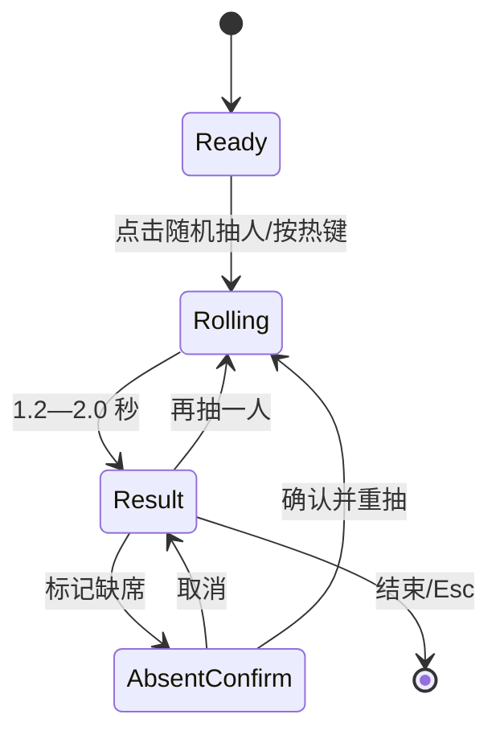

# EvoClass 界面设计说明

> 设计版本：UI Concept 0.1  
> 对应产品文档：`EvoClass-产品技术规格书.md`  
> 目标平台：Windows 10 / Windows 11  
> 实现技术：WPF + WPF-UI  
> 设计日期：2026-08-09

## 1. 设计结论

EvoClass 的界面不应被设计成传统“打开后长期占用屏幕”的管理软件，而应由三个视觉层级组成：

1. **桌面常驻层**：悬浮入口和可选的当前课程状态条，体积小、低对比、默认不抢焦点。
2. **课堂展示层**：晨间信息、值日提醒、随机抽人等中央展示，字号大、结构简单、后排可读。
3. **管理配置层**：完整主窗口，负责课程、学生、岗位、提醒、热键和系统设置。

设计参考 ClassIsland 的常驻课堂工具思路、主展示与配置分离、课表信息颜色编码等通用原则，但不复制其名称、图标、素材、具体布局或视觉细节。EvoClass 使用更接近 Windows 11 Fluent 的独立视觉语言，并对 MVP 功能做明显收敛。

## 2. 本次图稿

### 2.1 总览板


总览板同时表达管理窗口、悬浮入口、快捷面板和中央展示层之间的视觉层级关系。

### 2.2 管理主窗口——概览页


页面将“现在发生什么”放在首屏，而不是先展示配置入口。教师打开主窗口后首先看到当前课、下一节课、今日岗位、课程序列和最近提醒。

### 2.3 桌面常驻——悬浮入口与快捷菜单


悬浮入口靠左吸附，展开后形成纵向面板。高频课堂动作均在一次点击后可见，避免径向菜单在触控大屏上难以发现和命中。

### 2.4 中央展示层——随机抽人结果态


姓名是唯一的主视觉焦点；小组、本轮剩余人数和操作按钮处于次级层级。背景压暗但仍可辨识，提醒教师当前课件并未被关闭。

### 2.5 中央展示层——晨间信息


晨间信息使用左右双栏：左侧为岗位，右侧为课表。底部统一承载临时变化、自动收起倒计时和进度。

## 3. 设计原则

### 3.1 安静常驻

- 常驻控件不使用大面积高饱和色、发光球或持续循环动画。
- 悬浮入口在空闲时降低到约 55%—65% 不透明度，指针或触摸靠近后恢复。
- 自动提醒默认使用不激活窗口，不改变 PowerPoint、白板或浏览器的键盘焦点。
- 仅将主题色用于当前状态、主要按钮、进度和必要的强调线。

### 3.2 课堂优先

- 教师高频操作必须在悬浮入口展开后一步完成。
- 所有中央展示都以 3—5 米观看距离作为排版基线。
- 姓名、科目、岗位人员不使用细字重；核心信息至少 `Semibold`。
- 自动关闭不是隐藏逻辑：界面必须显示剩余时间或进度，让用户知道它会何时消失。

### 3.3 数据可解释

- 同时显示教学周与轮换周，避免“第几周”含义不清。
- 临时换课和临时替换必须带日期标记，并明确“不改变基础规则”。
- 随机抽人显示“本轮不重复”和“本轮剩余人数”，帮助教师理解算法状态。
- 运行状态和数据异常使用文字解释，不仅依赖红、黄、绿颜色。

### 3.4 独立而熟悉

- 熟悉来自 Windows Fluent 的窗口、导航、按钮和焦点行为。
- 独立来自 EvoClass 的蓝色菱形标记、课堂状态条、展示层顶部状态线和色彩规则。
- 不使用与 ClassIsland 相同的图标、资产、控件排列或逐像素布局。

## 4. 信息架构

### 4.1 管理导航

建议 MVP 左侧导航保持 8 个一级入口：

| 顺序 | 页面 | 主要任务 |
| --- | --- | --- |
| 1 | 概览 | 确认今日计算结果和运行状态 |
| 2 | 今日与课程表 | 编辑作息、课程方案和临时换课 |
| 3 | 学生与小组 | 维护名单、小组和临时缺席 |
| 4 | 值日与岗位 | 配置岗位、轮换和临时替换 |
| 5 | 提醒与自动化 | 编辑课前、课间和放学提醒 |
| 6 | 快捷操作与热键 | 配置快捷菜单排序和全局热键 |
| 7 | 外观与窗口 | 主题、透明、吸边和多显示器行为 |
| 8 | 系统与启动 | 开机启动、托盘、备份、日志和版本 |

“数据、日志与关于”可放在导航底部作为独立低频入口；窗口高度不足时导航区域滚动，但底部班级状态始终固定。

### 4.2 展示层内容模板

中央展示层共用以下结构：

1. 顶部 6—8 DIP 状态色线。
2. 标题区：功能名、班级、模式说明、关闭按钮。
3. 主信息区：姓名、课程或岗位。
4. 辅助信息区：小组、剩余人数、临时变化等。
5. 操作区：主要动作、次要动作和键盘提示。
6. 自动提醒状态区：倒计时文字与线性进度。

共用壳可以显著减少 WPF 窗口样式、动效和无障碍实现的重复工作。

## 5. 视觉系统

### 5.1 色彩 Token

| Token | 建议值 | 用途 |
| --- | --- | --- |
| `Brand.Primary` | `#2563EB` | 当前课程、主要操作、进度 |
| `Brand.Hover` | `#1D4ED8` | 主按钮 Hover |
| `Brand.Pressed` | `#1E40AF` | 主按钮 Pressed |
| `Surface.Window` | `#FBFCFE` | 管理窗口内容底色 |
| `Surface.Nav` | `#F3F6F9` | 左侧导航底色 |
| `Surface.Raised` | `#FFFFFF` | 面板、按钮、弹层 |
| `Text.Primary` | `#172033` | 主文本 |
| `Text.Secondary` | `#64748B` | 辅助文本 |
| `Border.Default` | `#E2E8F0` | 分隔线和边框 |
| `State.Success` | `#10B981` | 正常、已完成 |
| `State.Warning` | `#D97706` | 需注意、擦黑板等岗位色 |
| `State.Danger` | `#DC2626` | 救援、错误、强制动作 |
| `Feature.Random` | `#7C3AED` | 随机抽人专属识别色 |

学科颜色用于快速定位，不应取代科目文字。颜色数量建议控制在 8—10 个预设色，用户选色时显示对比度结果。

### 5.2 字体层级

字体优先级：`Segoe UI Variable` → `Microsoft YaHei UI` → `Segoe UI`。

| 场景 | 字号建议 | 字重 |
| --- | --- | --- |
| 管理页标题 | 28—32 DIP | Semibold |
| 管理页区块标题 | 20—24 DIP | Semibold |
| 管理正文 | 13—15 DIP | Regular |
| 按钮 | 14—16 DIP | Semibold |
| 展示层功能标题 | 20—26 DIP | Semibold |
| 展示层姓名 | 64—76 DIP | Semibold / Bold |
| 展示层岗位人员 | 32—44 DIP | Semibold |
| 展示层辅助信息 | 16—20 DIP | Regular |

对于超长姓名：优先换行；只有在两行仍溢出时才按明确断点缩小，安全下限为 48 DIP。禁止按窗口宽度连续缩放，以免造成每次名字变化时明显跳动。

### 5.3 间距与圆角

- 基础间距单位：4 DIP。
- 页面外边距：32—48 DIP。
- 区块间距：24—32 DIP。
- 表单行高：40—44 DIP。
- 触控按钮最小尺寸：44 × 44 DIP，课堂主按钮建议 48—56 DIP 高。
- 普通控件圆角：6—8 DIP。
- 中央展示层圆角：16—22 DIP。
- 悬浮入口可使用 20—24 DIP 圆角，但不要把全部管理内容做成胶囊形。

### 5.4 材质与阴影

- Windows 11 管理主窗口可使用 Mica；内容区仍保持接近不透明，确保文字稳定清晰。
- 快捷面板和中央展示层可用 Acrylic，但必须在高对比模式、远程桌面或性能不足时回退为纯色。
- 阴影只用于区分窗口层级，不用于每个小卡片。
- Windows 10 使用 `Surface.Raised` 纯色加 1 DIP 边框，不以透明效果作为必要信息表达。

## 6. 核心界面规格

### 6.1 悬浮入口

- 默认宽 64—72 DIP，高 116—144 DIP；首要按钮显示品牌标记，次要位置可显示最近使用动作。
- 距屏幕工作区边缘保持 8—12 DIP，避免与系统触控边缘手势冲突。
- 支持纵向拖动；水平拖动超过阈值后可迁移到另一侧或另一显示器。
- `PointerPressed` 后进入候选拖动态，移动超过 6 DIP 才确认为拖动，防止拖动后误触发单击。
- 自动隐藏时保留 8—12 DIP 可见把手；靠近屏幕边缘后在 160—220 ms 内展开。
- 位置按“显示器设备路径 + DPI + 边缘 + 相对纵向比例”保存，分辨率变化后仍能恢复到合理位置。

### 6.2 快捷菜单

- 建议宽 340—390 DIP，菜单行高 60—72 DIP。
- 图标、标题和热键从左到右排列；热键是说明，不作为按钮的一部分。
- 危险动作“救援中心”仅使用红色图标，不使用整行红底，避免与“立即强制结束”混淆。
- 打开后默认聚焦上一次使用项；方向键移动，`Enter` 执行，`Esc` 收起。
- 点击面板外部收起，但触控场景需忽略打开动作结束前 200 ms 内的外部点击。

### 6.3 管理概览页

- 首屏按“当前课程 → 今日岗位 → 今日课表 → 快捷操作 → 运行状态”排序。
- 当前课程使用一块大面积浅蓝信息区，但不嵌套额外卡片。
- 课程进度只在课程进行时显示；课间状态改为“课间”并显示下一节倒计时。
- 今日岗位固定显示岗位名与人员；无排班时显示原因，例如“今天不是教学日”。
- 数据异常应进入显眼但克制的内联警告条，并提供“查看问题”按钮。
- “临时换课”和“替换人员”必须再次显示生效日期，提交后提供撤销入口。

### 6.4 随机抽人

状态流程：



- 随机结果在动画开始前由领域服务计算，滚动动画只负责表现。
- `Rolling` 状态禁用重复提交；不允许按键连击产生多个历史记录。
- 结果出现时通过 UI Automation 宣读“抽中：姓名，第几小组”。
- “标记缺席”使用二次确认，并明确缺席有效期。
- 减少动态效果开启时直接淡入结果，时长 120—160 ms。

### 6.5 晨间信息

- 普通 16:9 教室屏使用左右 46:54 双栏。
- 岗位人员按岗位色区分，但文字仍完整显示岗位名称。
- 课表最多首屏显示 6—8 节；更多课程可缩小行距，不应出现滚动条。
- 临时换课在对应课程行显示日期标记和“临时”标签。
- 鼠标移入、触摸按下或键盘焦点进入时暂停自动收起；离开后继续剩余计时，而不是重新开始。

### 6.6 救援中心

救援功能应与普通快捷操作保持一致的外壳，但内部强调安全层级：

1. 默认动作是“优雅关闭窗口”。
2. 超时后才出现“强制结束进程”。
3. 系统保护项不显示操作按钮，并解释“受保护的系统进程”。
4. 权限不足项显示状态，不循环弹出失败提示。
5. 强制结束确认框同时显示应用图标、窗口标题、进程名和未保存内容提示。

## 7. 动效与反馈

| 动作 | 时长 | 建议曲线 | 说明 |
| --- | --- | --- | --- |
| 悬浮入口唤醒 | 140—180 ms | `CubicEase Out` | 透明度 + 水平位移 |
| 快捷菜单展开 | 180—220 ms | `CubicEase Out` | 透明度 + 8 DIP 位移 |
| 中央展示进入 | 200—260 ms | `QuinticEase Out` | 透明度 + 0.98→1 缩放 |
| 中央展示退出 | 120—180 ms | `CubicEase In` | 透明度 + 4 DIP 位移 |
| 随机抽人滚动 | 1.2—2.0 s | 分段减速 | 不参与结果计算 |
| Snackbar | 160—220 ms | `CubicEase Out` | 不抢焦点 |

动画只改变 `Opacity` 与 `RenderTransform`。禁止对宽度、高度、边距和网格列宽持续动画，以免 WPF 高频布局导致课堂电脑掉帧。

## 8. 多显示器与响应规则

- 悬浮入口、快捷菜单和中央展示必须出现在触发动作所在显示器。
- 管理主窗口默认恢复到上次显示器；目标显示器不存在时回到主显示器工作区中央。
- 所有坐标使用 DIP，窗口落点最终转换为物理像素并限制在工作区内。
- 1366 × 768 下管理窗口导航可折叠为图标模式，内容区最小宽度建议 920 DIP。
- 中央展示层宽度：普通信息 720—860 DIP；随机抽人 900—1000 DIP；最大不超过工作区宽度的 88%。
- 125%、150%、175%、200% DPI 均需单独验证；不能只依赖系统自动缩放截图。

## 9. 键盘、触控与无障碍

- 所有图标按钮提供 `AutomationProperties.Name` 和 ToolTip。
- 快捷菜单支持方向键、`Enter`、`Space`、`Esc`。
- 随机抽人结果态支持 `Space` 再抽、`Esc` 结束，但文本输入控件聚焦时不得触发全局动作。
- 聚焦框使用 2 DIP 品牌色外框，不能只改变背景色。
- 正文与背景对比度至少 4.5:1；大字号至少 3:1。
- 高对比度模式禁用透明、阴影和自定义状态色，使用系统画刷。
- 触控命中区至少 44 × 44 DIP；图标可保持 20—24 DIP，但透明命中区必须足够大。

## 10. WPF / WPF-UI 落地建议

### 10.1 控件映射

| 设计元素 | 推荐实现 |
| --- | --- |
| 管理主窗口 | `FluentWindow` |
| 左侧导航 | `NavigationView` + 分组 `NavigationViewItem` |
| 页面标题与命令 | 页面 `Grid`，不套多层 `Card` |
| 分段切换 | `ToggleButton` 组或 WPF-UI Segmented 控件 |
| 普通反馈 | `Snackbar` |
| 二次确认 | `ContentDialog` |
| 快捷面板 | 独立无边框 `Window`，`ShowActivated=false` 可配置 |
| 中央展示 | 每显示器独立无边框 `Window` + 共用 `OverlayShell` |
| 状态图标 | `SymbolIcon` 或项目自有矢量路径 |
| 颜色 Token | `ResourceDictionary` + DynamicResource |

### 10.2 资源命名示例

```xml
<Color x:Key="EvoColorBrandPrimary">#2563EB</Color>
<Color x:Key="EvoColorTextPrimary">#172033</Color>
<Color x:Key="EvoColorTextSecondary">#64748B</Color>
<Color x:Key="EvoColorBorderDefault">#E2E8F0</Color>

<SolidColorBrush x:Key="EvoBrushBrandPrimary"
                 Color="{StaticResource EvoColorBrandPrimary}" />
<SolidColorBrush x:Key="EvoBrushTextPrimary"
                 Color="{StaticResource EvoColorTextPrimary}" />

<CornerRadius x:Key="EvoRadiusControl">7</CornerRadius>
<CornerRadius x:Key="EvoRadiusOverlay">20</CornerRadius>
<Thickness x:Key="EvoPagePadding">40,32,40,32</Thickness>
```

颜色资源必须拆分为 Color 与 Brush，方便主题、高对比度和状态切换；运行时主题资源引用使用 `DynamicResource`。

### 10.3 ViewModel 边界

- `OverviewViewModel` 只消费已经计算好的 `TodaySnapshot`，不自行计算轮换。
- `QuickPanelViewModel` 暴露可排序的 `QuickActionItemViewModel` 列表。
- `PresentationOverlayViewModel` 只负责当前展示请求、倒计时和关闭命令。
- `RandomPickerViewModel` 调用领域随机服务，动画状态不得反向影响抽取结果。
- 窗口定位、DPI 和不激活展示放在独立 Window Service，不写进页面 ViewModel。

## 11. 组件清单

MVP 建议优先实现以下可复用组件：

1. `EvoPageHeader`：标题、副标题、右侧命令。
2. `EvoStatusPill`：短状态与计数，不承担长文案。
3. `EvoCourseTile`：时间、科目、状态和临时覆盖标记。
4. `EvoDutyRow`：岗位色、岗位名称、人员。
5. `EvoQuickActionItem`：图标、标题、热键和危险等级。
6. `EvoOverlayShell`：状态线、标题区、内容区、操作区和关闭逻辑。
7. `EvoCountdownFooter`：剩余时间、暂停状态和进度条。
8. `EvoEmptyState`：无教学日、无排班、无提醒等解释性空状态。
9. `EvoInlineValidation`：冲突、缺失和临时覆盖提示。

不要为每个内容块创建视觉 Card 控件；组件复用应聚焦语义、状态和交互，而不是重复添加边框与阴影。

## 12. 验收检查

### 12.1 视觉

- [ ] 1366 × 768、1920 × 1080、4K + 200% DPI 无裁切。
- [ ] 最长姓名、最长科目名和 8 个岗位人员不会撑动整体布局。
- [ ] Windows 10 纯色回退后信息层级仍完整。
- [ ] 高对比度主题下所有状态可读。
- [ ] 学科颜色移除后仍可通过文字识别。

### 12.2 交互

- [ ] 悬浮入口拖动不会误触发点击。
- [ ] 自动提醒不抢课件焦点。
- [ ] `Esc` 在所有展示层一致关闭。
- [ ] 随机抽人连续按键不会写入重复记录。
- [ ] 自动收起可被鼠标、触控和键盘交互暂停。
- [ ] 多显示器拔插后窗口不会落在不可见区域。

### 12.3 性能

- [ ] 快捷菜单首次展开无明显卡顿。
- [ ] 中央展示动画稳定，低性能模式可关闭模糊材质。
- [ ] 动态姓名变化不触发整个窗口重新布局。
- [ ] 后台状态刷新不在 UI 线程执行轮换或数据库查询。

## 13. 后续图稿优先级

下一轮建议按以下顺序继续补齐：

1. 课程表编辑页：N 周切换、临时换课和冲突校验。
2. 值日与岗位页：岗位列表、队列编辑、未来 4 周预览。
3. 救援中心：普通窗口列表、优雅关闭、强制结束确认。
4. 首次启动向导：班级、学生、科目、作息、轮换、预览。
5. 深色主题与 Windows 10 不透明回退稿。

本次图稿已经确定产品的基础视觉语言与三个运行层级，后续页面应继续复用相同 Token、导航、Overlay Shell 和状态表达，不再为每个功能单独创造一套样式。
