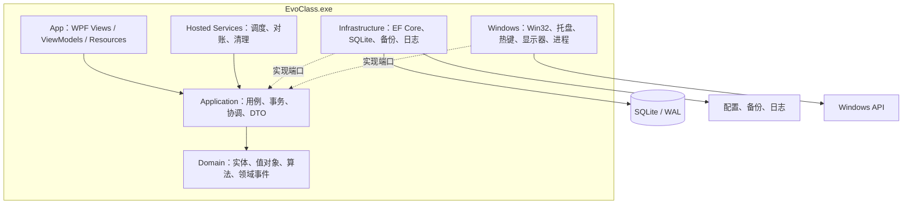
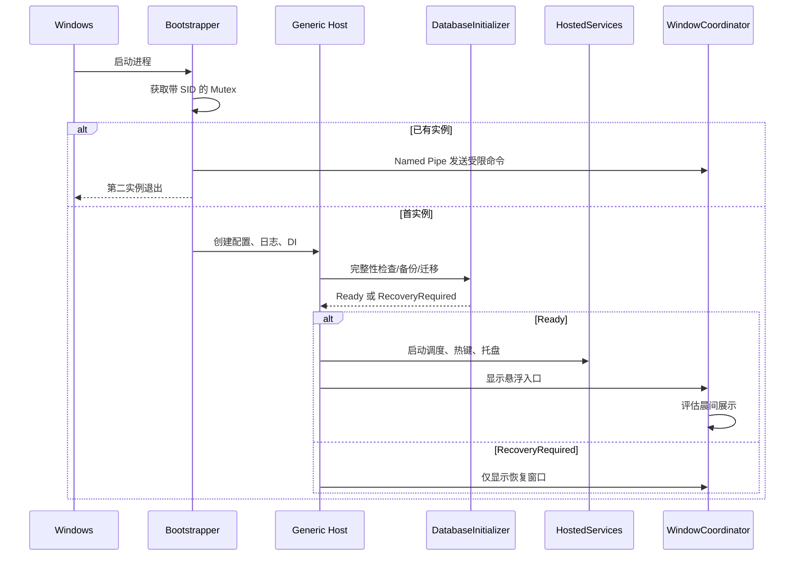
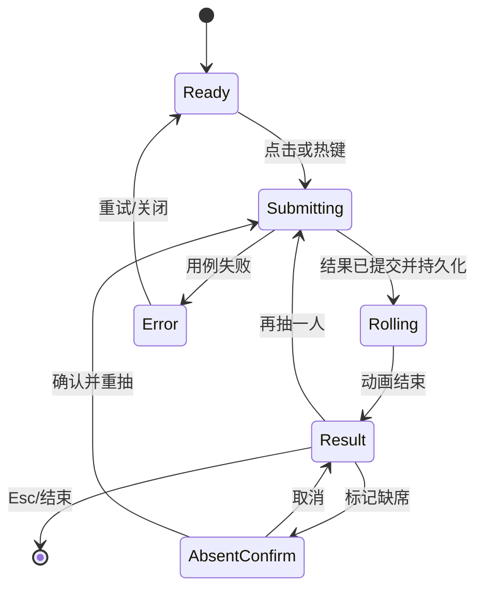
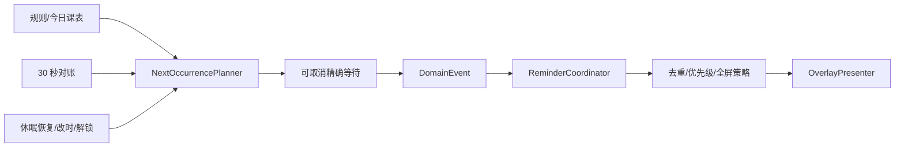
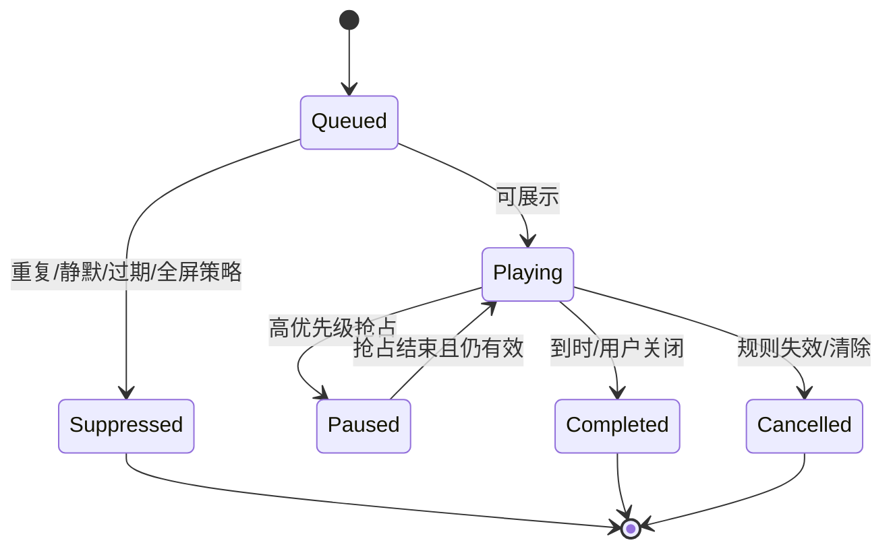

# EvoClass 详细技术设计规范

> 文档编号：EVO-TDS-001  
> 文档状态：Draft / 可进入 Sprint 0 评审  
> 版本：0.1.0  
> 编写日期：2026-08-09  
> 适用版本：EvoClass MVP / 0.1  
> 目标平台：Windows 10 / Windows 11  
> 技术基线：C#、.NET 10、WPF、WPF-UI、EF Core、SQLite

## 1. 文档目的与效力

本规范把 `EvoClass-产品技术规格书.md` 中的产品需求、领域规则和质量目标，以及 `EvoClass-界面设计说明.md` 中的视觉、交互和窗口约束，转换为可直接用于建库、编码、联调、测试和发布的工程规则。

本规范使用以下强度词：

- **必须（MUST）**：不满足即视为实现缺陷或验收失败。
- **应该（SHOULD）**：默认必须遵守；偏离时必须在 ADR 或 PR 中记录原因。
- **可以（MAY）**：按场景选择，不影响兼容性和验收。

文档冲突时按以下顺序处理：

1. 产品范围、业务规则和 P0/P1 优先级以产品技术规格书为准。
2. 视觉、尺寸、动效、焦点和无障碍行为以界面设计说明为准。
3. 代码分层、数据结构、接口、事务、错误处理和交付流程以本规范为准。
4. 仍无法判断时建立 ADR，在结论确定前不得把临时方案扩散到多个模块。

## 2. 范围、假设与非目标

### 2.1 MVP 范围

MVP 必须包含：首次启动向导、班级档案、学生与小组、科目与作息、1—8 周轮换课表、校历与日期级覆盖、岗位轮换、晨间信息、悬浮入口、快捷面板、中央展示层、随机抽人、提醒、全局热键、系统托盘、单实例、开机启动、救援中心、本地备份与恢复。

### 2.2 默认产品假设

- 单机、单 Windows 用户、单活动班级档案；数据模型保留多档案能力。
- 离线优先，核心运行路径不得依赖网络。
- 以 1920×1080 触控大屏为主，兼容 1366×768 与 4K/200% DPI。
- 周起始日固定为周一；轮换周锚点必须是第 1 周的周一。
- 日期和作息按档案的 `TimeZoneId` 解释；默认 `Asia/Shanghai`。
- 救援中心的“强制结束”默认关闭，需在系统设置中显式启用。
- 随机抽取历史默认保留至学期结束；审计与历史可单独清除。

### 2.3 技术非目标

- MVP 不实现插件加载、脚本执行、云同步、账号、网络集控或跨平台抽象。
- 不在 ViewModel、代码隐藏或页面定时器中实现领域规则。
- 不复制或修改 ClassIsland 源码、品牌、图标、素材或逐像素布局。
- 不使用微服务、消息中间件或独立后台 Windows Service。

## 3. 质量目标与工程预算

| 维度 | 必须达到的目标 | 测量方式 |
| --- | --- | --- |
| 冷启动 | 悬浮入口 5 秒内可操作 | 干净启动，P95，目标设备 |
| 热启动 | 2 秒内可操作 | P95 |
| 快捷面板 | 热态 P95 < 150 ms | 点击/热键到首帧 |
| 中央展示 | P95 < 300 ms | 请求到首帧 |
| 热键反馈 | P95 < 250 ms | `WM_HOTKEY` 到界面反馈 |
| 空闲 CPU | 5 分钟平均 < 0.5% | Release、自包含构建 |
| 空闲内存 | MVP < 150 MB | 稳态工作集 |
| 调度准确性 | 正常运行误差 <= 1 秒 | 事件实际时间与目标时间 |
| 恢复容错 | 休眠/改时后 30 秒内完成对账 | 自动化测试 + 人工矩阵 |
| 数据可靠性 | 已成功提交的事务不得部分丢失 | 故障注入、断电模拟 |
| 常驻能力 | 7 天无未处理异常和持续内存增长 | Soak test |
| 可访问性 | WCAG 对比度、键盘闭环、高对比可用 | Accessibility Insights/人工 |

任何进入主分支的功能不得使启动、热键、调度和随机抽取关键路径依赖网络、磁盘全表扫描或 UI 线程数据库访问。

## 4. 总体架构

### 4.1 架构风格

采用**模块化单体 + 分层架构 + 端口适配器**。一个桌面进程承载 WPF UI、后台调度、托盘、热键和本地存储。领域层保持纯净，Windows 与持久化能力通过接口注入。



### 4.2 依赖规则

| 项目 | 可引用 | 禁止引用 |
| --- | --- | --- |
| `EvoClass.Domain` | BCL | WPF、EF Core、Win32、日志实现 |
| `EvoClass.Application` | Domain、抽象包 | App、Infrastructure、Windows |
| `EvoClass.Infrastructure` | Application、Domain、EF Core | App |
| `EvoClass.Windows` | Application、Domain、Win32 interop | App 的 View/ViewModel |
| `EvoClass.App` | Application、Domain、Infrastructure、Windows | 直接 SQL、散落 P/Invoke |

构建时使用架构测试验证引用方向。UI 项目只能在 Composition Root 注册具体实现，不得绕过 Application 直接访问 `DbContext`。

### 4.3 运行时线程模型

- WPF Dispatcher 线程只负责属性更新、窗口操作和轻量格式化。
- EF Core、文件、备份、日志压缩、窗口枚举等 I/O 在后台执行。
- 调度器使用 `BackgroundService`；不得用 View 的 `DispatcherTimer` 承担业务触发。
- Win32 窗口消息由一个隐藏消息窗口集中接收，再转换为强类型应用命令。
- 所有跨线程 UI 更新通过 `IUiDispatcher` 封装。
- 所有后台循环必须接受 `CancellationToken`，退出超时默认 5 秒。

### 4.4 关键运行链路



## 5. 解决方案与代码组织

```text
EvoClass.sln
src/
  EvoClass.App/
    Bootstrap/                  # App.xaml、Host、DI、未处理异常
    Views/                      # Pages、Windows、Dialogs
    ViewModels/                 # 页面/窗口 VM
    Controls/                   # 语义组件
    Resources/                  # Themes、Tokens、Styles、Icons
    Behaviors/                  # Focus、Drag、Automation 等
  EvoClass.Application/
    Abstractions/               # Repository、Clock、Windows 端口
    Features/                   # 按功能纵向组织的 Commands/Queries
    Scheduling/                 # 事件规划与提醒协调
    Contracts/                  # DTO、Result、错误码
  EvoClass.Domain/
    Profiles/ Students/ Scheduling/ Duties/
    Reminders/ Randomization/ Rescue/
    Common/                     # Entity、ValueObject、DomainEvent
  EvoClass.Infrastructure/
    Persistence/                # DbContext、Mappings、Migrations
    Repositories/
    Configuration/
    Backup/
    Logging/
  EvoClass.Windows/
    Interop/ Hotkeys/ Tray/ Startup/ Displays/
    Windows/ Rescue/ SystemEvents/ SingleInstance/
tests/
  EvoClass.Domain.Tests/
  EvoClass.Application.Tests/
  EvoClass.Infrastructure.Tests/
  EvoClass.Windows.Tests/
  EvoClass.Ui.Tests/
  EvoClass.Architecture.Tests/
build/
installer/
docs/adr/
```

### 5.1 功能目录约定

Application 按功能而非技术类型组织，例如：

```text
Features/Schedules/
  GetTodaySnapshot/
    GetTodaySnapshotQuery.cs
    GetTodaySnapshotHandler.cs
    TodaySnapshotDto.cs
  SaveSchedule/
    SaveScheduleCommand.cs
    SaveScheduleHandler.cs
    SaveScheduleValidator.cs
```

每个写用例必须明确：输入 DTO、权限/前置校验、事务边界、领域调用、持久化、领域事件、返回结果。读用例返回专用 DTO，不把 EF 实体暴露给 UI。

### 5.2 工程公共配置

- `TargetFramework`: `net10.0-windows10.0.19041.0`
- `Nullable`: `enable`
- `ImplicitUsings`: `enable`
- `TreatWarningsAsErrors`: `true`
- `AnalysisLevel`: `latest-recommended`
- `LangVersion`: `latest`
- 包版本统一放入 `Directory.Packages.props`。
- `global.json` 固定 SDK 功能带，允许最新补丁滚动。
- Release 发布：`win-x64`、`SelfContained=true`、`PublishReadyToRun=true`、`PublishSingleFile=false`。

## 6. 领域设计

### 6.1 通用类型

- 所有实体 ID 使用应用生成的 `Guid`，数据库存为 16-byte BLOB 或规范化字符串；全项目只能选一种表示。
- 领域日期使用 `DateOnly`，时刻使用 `TimeOnly`，绝对时间使用 `DateTimeOffset`。
- 当前时间必须通过 `TimeProvider`/`IClock` 注入，禁止直接调用 `DateTime.Now`。
- 名称在写入前 `Trim()`；空白字符串视为无效。
- 颜色使用 `ArgbColor` 值对象，数据库存 `#AARRGGBB`。
- 排序使用非负整数 `SortOrder`；同一父级内保持唯一或在事务中重排。

### 6.2 聚合边界

| 聚合根 | 内部对象 | 关键不变量 |
| --- | --- | --- |
| `ClassProfile` | 学期、时区、活动状态 | 学期结束不早于开始；最多一个活动档案 |
| `TimeLayout` | `TimeSlot` | 时段开始 < 结束；同一布局不可重叠 |
| `ScheduleCycle` | `ScheduleEntry` | `WeekCount` 1—8；锚点为周一；单元格唯一 |
| `DutyRole` | `RotationPolicy`、`RotationMember` | 人数 > 0；成员类型与岗位类型一致 |
| `ReminderRule` | Trigger、Presentation | 持续时间、偏移和优先级在允许范围内 |
| `RandomBagState` | RemainingIds、Round | 剩余 ID 不重复且属于当前候选范围 |

Student、Subject、Group 等引用对象独立持久化；删除采用“引用检查后软停用优先”，避免破坏历史解释。

### 6.3 课表解析规则

`IScheduleResolver.Resolve(date, now)` 必须按以下固定顺序计算：

1. 读取活动档案与时区，将 `now` 转为档案本地时间。
2. 解析 `CalendarOverride`；确定教学日、使用星期和可选轮换周覆盖。
3. 若非教学日，返回 `NonTeachingDay`，但保留解释信息。
4. 计算基础轮换周：`positiveModulo(floor(days/7), WeekCount)+1`。
5. 读取该轮换周、星期、活动作息下的基础课表。
6. 应用日期级 `ScheduleOverride`；覆盖可换课或停课。
7. 按作息边界计算 `BeforeSchool/InSlot/Break/AfterSchool` 与当前/下一课程。
8. 返回 `ResolutionTrace`：锚点、周期、基础周、覆盖来源和生效规则。

边界采用半开区间 `[Start, End)`；正好位于结束时刻不再属于上一时段。跨午夜时段不在 MVP 支持，保存时必须拒绝。

### 6.4 岗位轮换规则

按教学日轮换：

```text
teachingDayIndex = countTeachingDays(anchorDate, targetDate)
turn = floor(teachingDayIndex / interval)
start = positiveModulo(turn * peoplePerTurn, memberCount)
```

按周轮换：

```text
weekIndex = floor((startOfWeek(target)-startOfWeek(anchor))/7 days)
turn = floor(weekIndex / interval)
start = positiveModulo(turn * peoplePerTurn, memberCount)
```

- 一次多人时从 `start` 环形取 `peoplePerTurn` 名，不得因为跨队尾少取人。
- 成员停用后不进入新计算；历史结果保留原引用快照。
- 日期级 `DutyOverride` 优先于基础规则，不改变队列游标。
- 计算结果必须返回 `RotationTrace`，供未来 4 周预览解释。
- 校历改变后，教学日序列缓存必须整体失效并重建。

### 6.5 随机抽人规则

候选范围由 `Scope`（全班/小组/自选）决定，再排除停用和当前日期有效的缺席记录。默认算法为 Fisher–Yates 洗牌袋：

1. 在事务中读取或创建 `RandomBagState`。
2. 新轮开始时使用 `RandomNumberGenerator` 提供随机整数完成 Fisher–Yates。
3. 结果在动画开始前持久化；动画不访问随机源。
4. 同一 UI 请求携带 `RequestId`；重复提交返回同一结果，不新增历史。
5. 候选变化时保留仍有效的未抽 ID，新成员加入未抽部分后只重洗未抽部分。
6. 袋耗尽后 `Round + 1`，创建新洗牌序列。

抽取、袋状态和历史写入必须处于同一 SQLite 事务。多人抽取要么全部成功，要么不改变袋状态。

### 6.6 提醒领域规则

提醒事件键格式：

```text
{ProfileId}:{RuleId}:{LocalDate:yyyyMMdd}:{TriggerKind}:{SlotId-or-Time}
```

- 同一事件键在去重窗口内只允许进入一次。
- 请求包含：`EventKey`、优先级、创建/到期时间、模板、文本、声音、显示器策略、可否抢占和自动关闭时长。
- 高优先级可暂停低优先级；低优先级恢复时使用剩余时长，不重新计时。
- 过期普通提醒进入 `Suppressed(Expired)`，不补播。
- TTS/音频失败不改变视觉提醒状态。
- 规则被编辑或删除时，尚未播放的旧请求必须取消。

## 7. 数据持久化设计

### 7.1 数据目录

```text
%LocalAppData%\EvoClass\
  data\evoclass.db
  config\appsettings.json
  config\appsettings.last-known-good.json
  backups\
  logs\
  cache\
```

便携模式仅由 `--portable` 显式启用，目录为程序旁 `Data`。应用不得用目录可写性猜测模式。

### 7.2 SQLite 连接初始化

每次连接必须启用：

```sql
PRAGMA foreign_keys = ON;
PRAGMA journal_mode = WAL;
PRAGMA synchronous = NORMAL;
PRAGMA busy_timeout = 5000;
```

数据库写操作串行化到短事务。DbContext 使用 `IDbContextFactory<EvoClassDbContext>` 创建，用例结束立即释放。禁止把 DbContext 注册为 Singleton 或由 ViewModel 长期持有。

### 7.3 逻辑表设计

下表给出 MVP 必须落地的核心表；所有业务表均包含 `CreatedAtUtc`、`UpdatedAtUtc`，可编辑聚合增加并发令牌 `Version`。

| 表 | 关键列 | 约束/索引 |
| --- | --- | --- |
| `ClassProfiles` | Id, Name, TermStart, TermEnd, TimeZoneId, IsActive | 唯一过滤索引确保一个活动档案 |
| `StudentGroups` | Id, ProfileId, Name, SortOrder, IsEnabled | `(ProfileId, Name)` 唯一 |
| `Students` | Id, ProfileId, Number, Name, GroupId, SortOrder, IsEnabled | `(ProfileId, Number)` 可空唯一；GroupId Restrict |
| `AbsenceRecords` | Id, StudentId, StartDate, EndDate, Reason | `(StudentId, StartDate, EndDate)` 索引 |
| `Subjects` | Id, ProfileId, Name, ShortName, Color, IsEnabled | `(ProfileId, Name)` 唯一 |
| `TimeLayouts` | Id, ProfileId, Name, IsDefault | 每档案一个默认布局 |
| `TimeSlots` | Id, LayoutId, Type, Name, StartMinute, EndMinute, SortOrder | `(LayoutId, SortOrder)` 唯一 |
| `ScheduleCycles` | Id, ProfileId, Name, WeekCount, AnchorDate, TimeLayoutId | AnchorDate 必须周一 |
| `ScheduleEntries` | Id, CycleId, CycleWeek, DayOfWeek, TimeSlotId, SubjectId | 四元组唯一 |
| `CalendarOverrides` | Id, ProfileId, Date, DayType, EffectiveDayOfWeek, CycleWeek | `(ProfileId, Date)` 唯一 |
| `ScheduleOverrides` | Id, ProfileId, Date, TimeSlotId, SubjectId, Kind, Note | `(ProfileId, Date, TimeSlotId)` 唯一 |
| `DutyRoles` | Id, ProfileId, Name, AssigneeType, PeoplePerTurn, SortOrder, IsEnabled | `(ProfileId, Name)` 唯一 |
| `RotationPolicies` | Id, RoleId, Unit, Interval, AnchorDate, SkipNonSchoolDays | RoleId 唯一 |
| `RotationMembers` | Id, RoleId, StudentId, GroupId, SortOrder, IsEnabled | StudentId/GroupId 二选一 |
| `DutyOverrides` | Id, RoleId, Date, Note | `(RoleId, Date)` 唯一 |
| `DutyOverrideAssignees` | OverrideId, StudentId, GroupId, SortOrder | 二选一；复合主键 |
| `ReminderRules` | Id, ProfileId, Name, TriggerJson, OffsetSeconds, Priority, PresentationJson, IsEnabled | `(ProfileId, IsEnabled)` 索引 |
| `HotkeyBindings` | Id, ProfileId, ActionId, Modifiers, VirtualKey, IsEnabled | ActionId 唯一；组合唯一 |
| `RandomBagStates` | Id, ProfileId, ScopeKey, CandidateHash, RemainingIdsJson, Round, Version | `(ProfileId, ScopeKey)` 唯一 |
| `RandomPickHistory` | Id, ProfileId, RequestId, ScopeKey, PickedAtUtc, ResultJson, Round | RequestId 唯一；日期索引 |
| `ReminderExecutions` | EventKey, RuleId, State, TriggeredAtUtc, CompletedAtUtc, SuppressReason | EventKey 主键 |
| `ActionAudits` | Id, TimeUtc, ActionType, TargetProcessId, TargetProcessName, TargetWindowTitleHash, ResultCode | TimeUtc 索引 |
| `AppState` | Key, JsonValue, UpdatedAtUtc | Key 主键 |

`StartMinute/EndMinute` 使用从午夜开始的分钟数，避免 SQLite 时间比较差异。`TriggerJson`、`PresentationJson` 只用于低频可扩展配置；需要查询或约束的字段必须拆成列。

### 7.4 删除与引用策略

- 学生、组、科目、岗位优先停用，不直接删除。
- 未被引用且无历史的草稿数据可硬删除。
- 档案删除采用显式确认并级联其配置；历史和审计是否一并删除必须在确认框列出。
- 课程项引用科目时使用 `Restrict`；先清理或替换引用再删除。
- 历史表保存必要显示快照，避免停用/重命名后历史不可读。

### 7.5 事务与并发

- 单个 Command Handler 是默认事务边界。
- 多表写入必须由 EF 执行策略内的显式事务包裹。
- 编辑页保存携带 `Version`；版本不一致返回 `EVO-CONFLICT-001`，UI 提供重新加载，不静默覆盖。
- 自动保存指“用户提交后自动持久化”，不代表每次键击写库。
- 页面使用 Draft ViewModel；取消、导航离开或对话框关闭不得污染已持久化实体。

### 7.6 迁移策略

1. 启动时读取应用和数据库 schema 版本。
2. 存在迁移时先检查磁盘空间并创建 `pre-migration` 备份。
3. 在独占维护阶段执行迁移；调度和热键尚未启动。
4. 迁移失败则保留原数据库和失败副本，进入恢复窗口。
5. 每个迁移必须有“从上一发布版升级”和“空库创建”集成测试。
6. 破坏性迁移需要 ADR、数据转换说明和回滚路径。

## 8. 应用层契约

### 8.1 统一结果模型

```csharp
public sealed record AppError(string Code, string UserMessage, string? Detail = null);

public readonly record struct Result<T>(T? Value, AppError? Error)
{
    public bool IsSuccess => Error is null;
}
```

异常用于不可预期故障；可预期校验、冲突、找不到、权限不足和热键占用使用 `Result<T>`。`UserMessage` 可直接显示但不得包含堆栈、路径或 SQL。

### 8.2 核心端口

```csharp
public interface ISchoolCalendarService
{
    ValueTask<bool> IsTeachingDayAsync(Guid profileId, DateOnly date, CancellationToken ct);
    ValueTask<int> GetTeachingDayIndexAsync(Guid profileId, DateOnly anchor, DateOnly date, CancellationToken ct);
}

public interface IScheduleResolver
{
    Task<DayScheduleDto> ResolveAsync(Guid profileId, DateOnly date, DateTimeOffset now, CancellationToken ct);
}

public interface IRotationEngine
{
    Task<RotationResultDto> ResolveAsync(Guid roleId, DateOnly date, CancellationToken ct);
}

public interface IReminderCoordinator
{
    ValueTask EnqueueAsync(ReminderRequest request, CancellationToken ct);
    ValueTask CancelByRuleAsync(Guid ruleId, CancellationToken ct);
}

public interface IDisplayService
{
    IReadOnlyList<DisplayInfo> GetDisplays();
    DisplayInfo ResolveTarget(DisplayTargetContext context);
    RectDip ConstrainToWorkArea(RectDip desired, DisplayInfo display);
}

public interface IGlobalHotkeyService
{
    HotkeyRegistrationResult TryRegister(HotkeyBindingDto binding);
    void Unregister(Guid bindingId);
    void UnregisterAll();
}

public interface IRescueService
{
    Task<CloseWindowResult> TryCloseForegroundWindowAsync(CancellationToken ct);
    Task<IReadOnlyList<VisibleAppWindow>> GetVisibleWindowsAsync(DisplayId display, CancellationToken ct);
    Task<TerminateProcessResult> TerminateConfirmedAsync(int processId, string confirmationToken, CancellationToken ct);
}
```

### 8.3 MVP 用例清单

| 功能 | Query | Command |
| --- | --- | --- |
| 概览 | `GetTodaySnapshot` | `AcknowledgeIssue` |
| 档案 | `GetActiveProfile` | `Create/Update/ActivateProfile` |
| 学生 | `SearchStudents`, `GetGroups` | `SaveStudentsBatch`, `SetAbsence` |
| 课程 | `GetScheduleGrid`, `PreviewDateSchedule` | `SaveTimeLayout`, `SaveSchedule`, `SetScheduleOverride` |
| 岗位 | `GetDutyPreview` | `SaveDutyRole`, `ReorderMembers`, `SetDutyOverride` |
| 随机 | `GetRandomState` | `PickStudents`, `ResetRandomRound`, `MarkAbsentAndRepick` |
| 提醒 | `GetReminderRules`, `PreviewReminder` | `SaveReminderRule`, `ToggleReminderRule` |
| 热键 | `GetHotkeys` | `ChangeHotkeyBinding` |
| 数据 | `GetBackupSummary` | `ExportBackup`, `ImportBackup`, `RestoreBackup` |
| 救援 | `GetVisibleWindows` | `CloseWindow`, `TerminateConfirmedProcess` |

### 8.4 TodaySnapshot

管理概览、悬浮状态和晨间展示共享同一次解析结果，避免各处自行计算：

```csharp
public sealed record TodaySnapshotDto(
    DateOnly Date,
    string TeachingWeekLabel,
    int? CycleWeek,
    DayState State,
    CourseOccurrenceDto? CurrentCourse,
    CourseOccurrenceDto? NextCourse,
    IReadOnlyList<CourseOccurrenceDto> Courses,
    IReadOnlyList<DutyAssignmentDto> Duties,
    IReadOnlyList<ActiveNoticeDto> Notices,
    IReadOnlyList<DataIssueDto> Issues,
    ResolutionTraceDto Trace,
    DateTimeOffset GeneratedAt);
```

快照按 `ProfileId + LocalDate + 数据修订号` 缓存。课表、校历、岗位、缺席或临时覆盖变更后立即失效；不得仅依赖固定过期时间。

## 9. UI 技术规范

### 9.1 UI 分层

UI 必须保持三个视觉层级、四种窗口职责：

| 层级 | 窗口 | 目标 | 激活规则 |
| --- | --- | --- | --- |
| 桌面常驻 | `FloatingEntryWindow` | 低干扰入口 | 永不主动激活 |
| 桌面常驻 | `QuickPanelWindow` | 一步触达高频动作 | 默认不激活；键盘唤起时可激活 |
| 课堂展示 | `PresentationOverlayWindow` | 晨间、岗位、课程、随机结果 | 自动提醒不激活；手动操作可激活 |
| 管理配置 | `ManagementWindow` | 完整编辑和维护 | 正常激活 |

不得把中央展示实现为管理窗口中的页面，也不得用系统通知替代教室可读的中央展示。

### 9.2 主题资源层次

资源必须按“原始值 → 语义 Token → 组件资源”三层组织：

```text
Resources/
  Tokens/Colors.Light.xaml
  Tokens/Colors.Dark.xaml
  Tokens/Colors.HighContrast.xaml
  Tokens/Typography.xaml
  Tokens/Spacing.xaml
  Themes/Theme.Light.xaml
  Themes/Theme.Dark.xaml
  Themes/Theme.HighContrast.xaml
  Components/Button.xaml
  Components/OverlayShell.xaml
  Components/CourseTile.xaml
```

业务控件只能引用语义 Brush，不得在页面 XAML 中散落 Hex 颜色。颜色必须拆为 `Color` 与 `SolidColorBrush`，可切换资源使用 `DynamicResource`。

### 9.3 色彩 Token

浅色主题基线：

| 语义 Token | 值 | 用途 |
| --- | --- | --- |
| `EvoColorBrandPrimary` | `#2563EB` | 当前课程、主操作、进度 |
| `EvoColorBrandHover` | `#1D4ED8` | Hover |
| `EvoColorBrandPressed` | `#1E40AF` | Pressed |
| `EvoColorSurfaceWindow` | `#FBFCFE` | 管理内容背景 |
| `EvoColorSurfaceNav` | `#F3F6F9` | 导航背景 |
| `EvoColorSurfaceRaised` | `#FFFFFF` | 弹层/面板 |
| `EvoColorTextPrimary` | `#172033` | 主文本 |
| `EvoColorTextSecondary` | `#64748B` | 次文本 |
| `EvoColorBorderDefault` | `#E2E8F0` | 边框/分隔线 |
| `EvoColorStateSuccess` | `#10B981` | 正常/完成 |
| `EvoColorStateWarning` | `#D97706` | 注意/岗位强调 |
| `EvoColorStateDanger` | `#DC2626` | 错误/强制动作 |
| `EvoColorFeatureRandom` | `#7C3AED` | 随机抽人 |

深色与高对比主题不得简单反色。深色资源在视觉评审前可以使用 WPF-UI 系统语义色作为临时映射；一旦发布深色主题，必须补齐对比度测试截图。高对比模式必须直接使用系统画刷，禁用透明、阴影和自定义状态色。

学科颜色只作辅助识别：科目名称始终可见；预设色控制在 8—10 个；选色器实时计算对比度并警告不达标组合。

### 9.4 字体、间距与尺寸

- 字体栈：`Segoe UI Variable` → `Microsoft YaHei UI` → `Segoe UI`。
- 管理页标题 28—32 DIP/Semibold，区块标题 20—24 DIP/Semibold，正文 13—15 DIP。
- 展示标题 20—26 DIP，姓名 64—76 DIP/Semibold 或 Bold，岗位人员 32—44 DIP，辅助信息 16—20 DIP。
- 长姓名优先两行；仍溢出时按 76/64/56/48 四档缩小，安全下限 48 DIP。
- 基础间距 4 DIP；页面外边距 32—48；区块间距 24—32；表单行高 40—44。
- 所有触控命中区至少 44×44 DIP；课堂主按钮高 48—56 DIP。
- 普通控件圆角 6—8；中央展示 16—22；默认资源分别为 7 和 20 DIP。
- 页面不得通过多层 Card 制造层级；优先空白、分隔线和对齐。

建议资源：

```xml
<CornerRadius x:Key="EvoRadiusControl">7</CornerRadius>
<CornerRadius x:Key="EvoRadiusOverlay">20</CornerRadius>
<Thickness x:Key="EvoPagePadding">40,32,40,32</Thickness>
<sys:Double x:Key="EvoTouchTargetMin">44</sys:Double>
<FontFamily x:Key="EvoFontFamily">Segoe UI Variable, Microsoft YaHei UI, Segoe UI</FontFamily>
```

### 9.5 动效规范

| 动效 | 时长 | 曲线 | 属性 |
| --- | --- | --- | --- |
| 悬浮入口唤醒 | 140—180 ms | Cubic Out | Opacity + TranslateX |
| 快捷面板展开 | 180—220 ms | Cubic Out | Opacity + 8 DIP 位移 |
| 中央展示进入 | 200—260 ms | Quintic Out | Opacity + Scale 0.98→1 |
| 中央展示退出 | 120—180 ms | Cubic In | Opacity + 4 DIP 位移 |
| 随机滚动 | 1.2—2.0 s | 分段减速 | 内容切换/Opacity |
| Snackbar | 160—220 ms | Cubic Out | Opacity + Transform |

动画禁止持续改变 Width、Height、Margin、GridLength。检测到系统“减少动态效果”时，统一切换 `IMotionPolicy.ReduceMotion=true`：随机结果直接 120—160 ms 淡入，其他位移动画仅保留淡入淡出。

### 9.6 可复用组件契约

| 组件 | 必须暴露的输入 | 必须处理的状态 |
| --- | --- | --- |
| `EvoPageHeader` | Title, Subtitle, Commands | 普通/窄宽 |
| `EvoStatusPill` | Text, Severity, AutomationName | 默认/高对比 |
| `EvoCourseTile` | Time, Subject, State, OverrideLabel | 当前/下一/普通/临时/停课 |
| `EvoDutyRow` | Role, Assignees, Accent, Explanation | 有安排/无教学日/无成员 |
| `EvoQuickActionItem` | Icon, Title, Hotkey, DangerLevel, Command | Normal/Hover/Pressed/Disabled |
| `EvoOverlayShell` | Accent, Header, Content, Actions, Footer | 自动/手动、激活/不激活 |
| `EvoCountdownFooter` | Duration, Remaining, IsPaused | 运行/暂停/结束 |
| `EvoEmptyState` | Title, Explanation, Action | 无数据/非教学日/过滤为空 |
| `EvoInlineValidation` | Severity, Message, Target | 警告/错误/冲突 |

组件必须有独立样式和 UI 冒烟测试；页面不得复制组件内部模板。

### 9.7 ViewModel 规则

- 所有 ViewModel 继承轻量 `ObservableObject`，使用 CommunityToolkit.Mvvm 命令和属性生成器。
- ViewModel 只消费 Application DTO，不持有领域实体和 DbContext。
- ViewModel 不引用 `Window`、`MessageBox`、`Process`、注册表或 P/Invoke。
- 导航、对话框、剪贴板、文件选择、窗口定位由强类型服务提供。
- 异步命令执行期间公开 `IsBusy`，需要防重入的命令设置并发禁用。
- 页面加载可取消；离开页面必须取消未完成查询。
- 错误通过 `IUserFeedbackService` 映射为内联校验、Snackbar 或 ContentDialog，不在代码隐藏中分散处理。

关键边界：

| ViewModel | 责任 | 明确不负责 |
| --- | --- | --- |
| `OverviewViewModel` | 展示 `TodaySnapshot`、触发快捷命令 | 计算课表/轮换 |
| `QuickPanelViewModel` | 排序后的快捷动作、执行状态 | 窗口定位、热键注册 |
| `PresentationOverlayViewModel` | 当前请求、倒计时、关闭 | Win32 激活策略 |
| `RandomPickerViewModel` | 调用抽取用例、切换 Ready/Rolling/Result | 决定随机结果 |
| `ScheduleEditorViewModel` | Draft 网格、即时校验、保存 | 直接写 EF 实体 |
| `RescueCenterViewModel` | 列表和确认流程 | 直接枚举/终止进程 |

### 9.8 输入、焦点与无障碍

- 所有图标按钮必须同时提供 `AutomationProperties.Name` 与 ToolTip。
- 快捷面板支持方向键、Enter、Space、Esc；默认焦点为上一次使用项。
- 展示层统一使用 Esc 关闭；随机结果态 Space 再抽，但文本输入聚焦时不触发。
- 焦点框为 2 DIP 可见轮廓，不得只改变背景。
- 自动提醒窗口不得改变前台窗口或键盘焦点。
- 随机结果出现时通过 UI Automation Live Region 宣读“抽中：姓名，第 N 小组”。
- 正文对比度至少 4.5:1，大字号至少 3:1；状态不得只依赖颜色。
- 自动收起在鼠标进入、触摸按下或键盘焦点进入时暂停；离开后从剩余时间继续。

## 10. 窗口详细设计

### 10.1 悬浮入口 `FloatingEntryWindow`

**窗口属性**：

```text
WindowStyle=None
ResizeMode=NoResize
ShowInTaskbar=false
Topmost=true
ShowActivated=false
WS_EX_TOOLWINDOW=true
WS_EX_NOACTIVATE=true
```

**尺寸与位置**：默认宽 68、高 128 DIP；距工作区边 10 DIP。位置持久化结构：

```json
{
  "displayDevicePath": "...",
  "edge": "Left",
  "relativeY": 0.50,
  "savedDpi": 144,
  "isAutoHidden": false
}
```

**拖动状态机**：`Idle → PressCandidate → Dragging → Snapping → Idle`。移动距离超过 6 DIP 才进入 Dragging；松开后仅在未进入 Dragging 时触发点击。自动隐藏保留 8—12 DIP 把手，靠近后 160—220 ms 展开。

显示器不存在或位置越界时，按 `relativeY` 恢复到主显示器工作区。坐标持久化使用 DIP 和相对比例，不保存裸物理像素。

### 10.2 快捷面板 `QuickPanelWindow`

- 宽 340—390 DIP，默认 368；菜单行高 60—72，默认 64。
- 与悬浮入口同屏，优先放在入口内侧；空间不足时上下翻转或左右翻转。
- 面板打开后 200 ms 内忽略由原始触摸抬起产生的外部点击。
- 行布局固定为图标、标题、弹性空白、热键；危险级仅染红图标。
- 点击动作后默认收起；需要连续交互的随机抽人由中央展示承接。
- 键盘唤起时允许激活并设置焦点；鼠标/触控打开时不抢占原应用焦点。

### 10.3 管理窗口 `ManagementWindow`

- 使用 `FluentWindow + NavigationView`。
- 推荐默认尺寸 1280×800 DIP，最小内容宽 920 DIP；1366×768 时导航折叠为图标模式。
- 恢复上次显示器和窗口状态；目标屏不存在则居中主屏工作区。
- 一级导航固定：概览、今日与课程表、学生与小组、值日与岗位、提醒与自动化、快捷操作与热键、外观与窗口、系统与启动；数据/日志/关于位于底部。
- 关闭按钮默认只关闭管理窗口并保留托盘常驻；真正退出必须走托盘“退出”或系统页命令。

### 10.4 中央展示 `PresentationOverlayWindow`

- 每次只显示一个活动 Overlay；提醒协调器管理排队/抢占。
- 普通信息宽 720—860 DIP，随机抽人 900—1000 DIP；最大为工作区宽度 88%。
- 自动展示 `ShowActivated=false`；手动随机和救援允许激活。
- 显示器选择：触发悬浮入口所在屏 > 当前前台窗口所在屏 > 主屏。
- Windows 11 可用 Acrylic/Mica；Windows 10、高对比、远程桌面或低性能策略回退纯色 + 1 DIP 边框。
- 共用 `EvoOverlayShell`：顶部 6—8 DIP 状态线、标题区、主信息、辅助信息、操作区、倒计时区。

### 10.5 随机抽人状态机



`Submitting` 和 `Rolling` 必须禁用重复提交。应用层按 `RequestId` 幂等，即使键盘连击或 UI 重试也只能生成一条历史。

### 10.6 晨间展示

- 16:9 使用 46:54 左右双栏；左为岗位，右为课表。
- 课表首屏 6—8 节，不显示滚动条；更多项目通过紧凑行距适配。
- 临时换课在行内显示日期与“临时”标签。
- 底部统一显示临时公告、自动收起倒计时和进度。
- “当天自动展示一次”由持久化 `AppState` 记录 `{ProfileId, LocalDate, CompletedAt}`；手动重开不改写自动展示判定。

### 10.7 救援中心

- 默认列出当前显示器可识别的普通顶层窗口，默认动作仅“优雅关闭”。
- `SendMessageTimeout(WM_CLOSE)` 超时后才允许出现“强制结束”。
- 系统保护项不显示操作按钮，并显示原因。
- 强制确认显示应用图标、窗口标题、进程名和未保存风险；确认后生成一次性 token，服务校验 token、进程 ID 和过期时间。
- 窗口列表刷新不得超过每秒 2 次，且在后台线程完成。

## 11. 管理页面实现规范

### 11.1 概览页

数据源只有 `GetTodaySnapshotQuery`。首屏顺序固定为：当前课程 → 今日岗位 → 今日课表 → 快捷操作 → 运行状态。

| 状态 | 显示要求 |
| --- | --- |
| 上课中 | 当前课、起止时间、进度、下一节 |
| 课间 | 明确“课间”、下一节和倒计时 |
| 非教学日 | 原因和校历来源，不显示伪空课表 |
| 数据异常 | 内联警告条 + “查看问题” |
| 临时覆盖 | 日期、“临时”标记、撤销入口 |

页面激活时刷新一次；收到 `ScheduleChanged/DutyAssignmentChanged/SystemTimeChanged` 后防抖 100 ms 刷新。不得每秒重查数据库；课程进度条可基于现有 DTO 和注入时钟本地更新。

### 11.2 今日与课程表页

- 周视图横轴星期，纵轴 `TimeSlot`；顶部按 1—N 周分段切换。
- 单元格编辑仅修改 Draft；保存前一次性校验。
- 支持复制、粘贴、清空；粘贴必须生成预览并标出无法映射科目。
- 即时校验：时段重叠、缺失科目、禁用科目、周号越界、重复单元格。
- 临时换课必须选择明确日期；保存确认文案注明“不改变基础课表”。
- 退出存在未保存更改时弹出保存/放弃/取消三选项。

### 11.3 学生与小组页

- 批量粘贴每行一人，支持 `座号,姓名,小组` 和纯姓名两种格式；解析结果先预览。
- 重复判定至少覆盖同档案同座号、完全相同姓名；同名不同人允许但必须提示。
- 缺席记录必须有结束日期，默认当天结束。
- 删除前查询排班与历史引用；有引用时优先提供停用。
- 大于 100 人时列表启用 UI 虚拟化；过滤在后台执行并防抖 200 ms。

### 11.4 值日与岗位页

- 三栏布局：岗位列表、规则/队列、未来 2—4 周预览。
- 队列拖动只改变 Draft `SortOrder`；保存时统一重排为连续整数。
- 切换轮换单位或人数后立即重算预览，但 150 ms 防抖且可取消。
- 预览每项必须能展开 `RotationTrace`：锚点、教学日序号/周序号、队列位置、覆盖来源。
- 临时替换要求日期、替换人和可选说明；不得修改基础队列。

### 11.5 提醒与自动化页

编辑器固定为“触发时机 → 提醒内容 → 展示方式”三段：

- 触发：课程开始/结束、课间、放学、自定义时间；偏移秒数有边界校验。
- 内容：标题、正文、岗位/课程模板变量、可选音效/TTS。
- 展示：优先级、持续时间、显示器策略、全屏策略、是否可抢占。
- 预览使用虚拟事件和独立 `Preview` 标识，不写 `ReminderExecutions`，不进入正常去重历史。
- MVP 只允许预置触发类型，不暴露任意脚本或表达式。

### 11.6 快捷操作与热键页

- 快捷项支持排序、显示/隐藏，不允许隐藏“打开主窗口”的所有入口。
- 新热键采用“先尝试注册 → 成功后持久化 → 释放旧组合”的顺序。
- 禁止单字母/数字、Windows 保留组合和未包含修饰键的普通字符。
- 注册失败显示冲突组合和可恢复旧值，不得保存无效绑定。

### 11.7 外观与窗口页

- 支持主题、透明材质、悬浮入口显示规则、透明度、边缘、自动隐藏、多屏默认策略和减少动画。
- 设置变更应提供实时预览；会导致入口不可见的设置必须有 10 秒恢复倒计时。
- 透明材质不可用时显示实际回退状态，而不是仍显示“已开启”。

### 11.8 系统、数据与日志页

- 每次打开页面都重新读取注册表自启动状态。
- 显示数据目录、数据库状态、最后备份、日志目录、应用/运行时/Windows 版本。
- 导入必须展示档案名、格式版本、记录数、创建时间、最低兼容版本和冲突。
- “打开目录”使用 Windows 服务抽象，并校验目录存在。
- 清除历史按随机历史、救援审计、日志、缓存分项执行，不提供含义不清的“一键全部清除”。

### 11.9 首次启动向导

向导只在“无活动档案”时自动进入；用户可从系统页再次启动，但再次启动默认创建新 Draft，不覆盖现有档案。


- 整个向导使用独立 `ProfileSetupDraft`，步骤间只保存到内存和可清理的临时草稿文件。
- “完成”时执行一次跨聚合应用事务；任一步失败不得留下半活动档案。
- 每步可以后退且保留输入；关闭向导时询问保存草稿或放弃。
- 学生批量导入、作息重叠、课程缺失、轮换锚点和热键冲突必须在相应步骤解决。
- 最终预览使用与正式运行相同的 `IScheduleResolver`、`IRotationEngine`，不得编写向导专用简化算法。
- 提交成功后注册热键、启动调度、创建悬浮入口，再根据晨间规则决定是否展示；任一外围能力失败不回滚业务档案，但必须在完成页列出可修复问题。

## 12. 调度、提醒与系统时间

### 12.1 调度器结构

`ScheduleHostedService` 只负责规划与投递，不直接控制窗口：



算法：计算最近未来事件 → 使用 `TimeProvider.Delay` 可取消等待 → 到时重新校验规则有效性 → 写入事件执行记录 → 投递。另有 30 秒轻量对账，处理时钟跳变和漏失。

### 12.2 需要监听的系统事件

- 休眠恢复、系统时间变化、时区变化、会话锁定/解锁。
- 显示器连接、断开、分辨率、投影模式和 DPI 变化。
- 活动档案、课表、校历、提醒规则发生变化。

收到事件后取消当前等待，重新加载必要数据并规划。UI 线程只接收最终状态，不参与重算。

### 12.3 漏失与回拨策略

- 普通事件容错窗口默认 60 秒，可配置范围 30—90 秒。
- 恢复时目标时间早于当前且超出容错窗口：记为 `Suppressed(Expired)`。
- 系统时间回拨依赖持久化 EventKey 去重，不再次播放同一事件。
- 当前/下一课程立即重算，不等待下一次 30 秒对账。
- 跨日后清理上一日内存队列，但保留持久化执行记录。

### 12.4 提醒协调器状态



相同优先级 FIFO；高优先级是否抢占由请求 `CanPreempt` 决定；暂停请求若恢复时已过期则直接完成为 Suppressed。

## 13. Windows 平台集成

### 13.1 单实例与命令转发

- Mutex 名称必须包含应用标识与当前用户 SID，避免不同用户会话互相阻塞。
- 第二实例通过 Named Pipe 发送 JSON 消息，最大 8 KiB，连接超时 2 秒。
- 允许命令白名单：`ShowMainWindow`、`ShowDuty`、`ShowSchedule`、`RandomPick`、`OpenRescueCenter`。
- 消息包含协议版本、命令、可选显示器上下文和 nonce；未知字段可忽略，未知命令必须拒绝。
- 不得接收 shell 命令、文件路径拼接或任意进程参数。

```json
{
  "protocolVersion": 1,
  "command": "ShowMainWindow",
  "displayDevicePath": null,
  "nonce": "4f0f..."
}
```

### 13.2 全局热键

- 使用 `RegisterHotKey/UnregisterHotKey`，由隐藏消息窗口接收 `WM_HOTKEY`。
- Win32 registration ID 由服务集中分配并映射到业务 Binding ID。
- 关闭、切换档案和应用退出时必须释放全部注册。
- 默认：`Ctrl+Alt+D` 值日、`Ctrl+Alt+R` 随机、`Ctrl+Alt+C` 当前课程、`Ctrl+Alt+Esc` 救援。
- 热键回调只发布应用命令，禁止在 WndProc 内执行数据库、动画或进程操作。

### 13.3 开机启动

非 MSIX 发布使用：

```text
HKCU\Software\Microsoft\Windows\CurrentVersion\Run
```

值为带引号绝对 EXE 路径和 `--autostart`。启用/禁用后立即回读验证；卸载必须清理。UI 显示的状态以注册表实际值为准，本地 JSON 仅保存用户偏好。

### 13.4 托盘

- 托盘菜单：打开主窗口、显示今日信息、暂停提醒、开机启动状态、退出。
- 单击默认打开主窗口，双击不得重复创建窗口。
- Explorer 重启导致托盘图标丢失时应自动重建。
- 退出流程：停止接收命令 → 取消调度 → 关闭 Overlay → 注销热键 → 移除托盘 → 刷新日志 → 释放 Mutex。

### 13.5 DPI 与显示器

- 应用声明 Per-Monitor V2 DPI 感知。
- `DisplayInfo` 至少包含设备路径、友好名、物理工作区、DPI X/Y、缩放比和主屏标志。
- Win32 物理像素与 WPF DIP 的转换必须集中在 `DisplayCoordinateConverter`。
- 监听 `WM_DPICHANGED`，采用系统建议矩形后再次约束到工作区。
- 保存悬浮位置用“设备路径 + 边缘 + 相对 Y”；保存普通窗口用 DIP 矩形 + 状态。
- 显示器拔出时所有可见窗口 500 ms 内回到主屏可见工作区。

### 13.6 前台与普通窗口识别

救援中心过滤流水线：

1. `EnumWindows` 枚举顶层窗口。
2. `IsWindowVisible` 为真。
3. 标题长度 > 0；排除当前应用自身窗口。
4. 排除 `WS_EX_TOOLWINDOW` 且无 `WS_EX_APPWINDOW` 的工具窗口。
5. `DwmGetWindowAttribute(DWMWA_CLOAKED)` 不为 cloaked。
6. 窗口矩形与目标显示器工作区有可见交集。
7. 解析进程 ID、进程名和图标；访问失败转为可理解状态而非丢弃整个列表。
8. 应用保护策略，系统关键进程标记为不可操作。

### 13.7 关闭与终止

- 优雅关闭使用 `SendMessageTimeout(WM_CLOSE, SMTO_ABORTIFHUNG, 2000 ms)`。
- 不得在 UI 线程同步等待目标窗口响应。
- 强制结束使用 `Process.Kill(entireProcessTree: false)`，不得默认结束进程树。
- 保护名单至少包含自身、`explorer.exe`、`dwm.exe`、`winlogon.exe`、`csrss.exe`、`lsass.exe`、`services.exe`、`svchost.exe`。
- 同时使用进程名和 Windows 关键进程判定；仅靠可修改配置黑名单不足以构成保护。
- 不主动提权。权限不足返回 `EVO-RSC-403` 并在列表行内显示。
- 每次关闭/终止写 `ActionAudit`，不记录窗口内容；窗口标题仅记录不可逆哈希或按隐私设置截断。

## 14. 配置设计

### 14.1 配置归属

| 类型 | 存储 | 示例 |
| --- | --- | --- |
| 业务数据 | SQLite | 学生、课表、岗位、提醒规则 |
| 设备偏好 | JSON | 主题、窗口位置、减少动画 |
| 系统事实 | 实时读取 | 自启动注册表、OS/显示器状态 |
| 短期运行态 | 内存 + 必要 AppState | 当前提醒队列、晨间已展示 |
| 敏感材料 | 不在 MVP 保存 | 设置密码/密钥 |

### 14.2 `appsettings.json` 示例

```json
{
  "schemaVersion": 1,
  "appearance": {
    "theme": "System",
    "material": "Auto",
    "reduceMotion": false,
    "floatingOpacityIdle": 0.60
  },
  "windows": {
    "floatingDisplayMode": "Always",
    "overlayDisplayPolicy": "TriggerDisplay",
    "floatingPlacements": []
  },
  "behavior": {
    "startMinimizedToTray": true,
    "forceTerminateEnabled": false,
    "normalReminderToleranceSeconds": 60
  },
  "backup": {
    "retentionCount": 10,
    "autoBackupEnabled": true
  }
}
```

配置保存采用临时文件 + 原子替换，并同步维护 last-known-good。未知字段保留或至少安全忽略；不识别的枚举回退默认值并记录 Warning。

### 14.3 配置校验

- 透明度 0.35—1.0，默认 0.60。
- 提醒容错 30—90 秒。
- 备份保留 7—14 份，默认 10。
- 窗口位置必须经过显示器约束，不直接信任 JSON。
- 配置损坏时将原文件改名为 `.corrupt-{timestamp}`，加载 last-known-good；两者均失败则使用默认值。

## 15. 备份、导入与恢复

### 15.1 备份包格式

扩展名 `.evoclass-backup`，内容：

```text
manifest.json
data/evoclass.db
config/appsettings.json
checksums.sha256
```

`manifest.json` 至少包含：`formatVersion`、`appVersion`、`minimumImporterVersion`、`createdAtUtc`、`profileSummaries`、各类记录数、数据库 schema 版本。

### 15.2 导出流程

1. 申请备份互斥，拒绝与迁移/导入并行。
2. 通过 SQLite Online Backup API 或受控 checkpoint 生成一致数据库副本；不得直接复制正在写入的 WAL 数据库主文件。
3. 复制已校验配置。
4. 生成 manifest 和 SHA-256。
5. 写入临时包，校验可重新打开后原子移动到目标路径。
6. 自动备份在每日首次有效业务修改后执行，同日后续修改不重复创建。

### 15.3 导入流程

1. 解压到应用专用临时目录；逐条规范化路径并防止 Zip Slip。
2. 限制条目数量、单条大小和总解压大小；MVP 默认总上限 500 MiB。
3. 验证 manifest、格式版本、最低导入版本和 SHA-256。
4. 以只读方式打开数据库并执行 `PRAGMA integrity_check`。
5. 展示预检摘要与冲突。
6. 用户确认后停止调度/热键写操作并创建 `pre-import` 备份。
7. 原子替换数据，执行必要迁移，重新加载服务。
8. 任一步失败恢复原数据并保留诊断日志。

### 15.4 恢复模式

以下情况进入专用恢复窗口，不启动正常调度：迁移失败、完整性检查失败、数据库无法打开、关键 schema 不兼容。恢复窗口只允许：查看简化错误、选择最近备份、导出损坏副本、打开日志目录、退出。

## 16. 安全与隐私

### 16.1 数据最小化

- 默认不联网，不上传学生名单、抽取历史、窗口标题或数据库。
- 业务日志使用学生 ID；姓名仅允许 Debug，且生产默认关闭。
- 崩溃信息必须移除姓名、数据库内容、窗口标题、完整本地路径。
- 不记录屏幕内容，不截取救援目标窗口图像。
- 提供分项清除历史与缓存能力。

### 16.2 本地权限

- 默认数据目录继承当前 Windows 用户 ACL，不创建 Everyone 可写目录。
- 用户级安装和运行无需管理员权限。
- 备份导入只接受本应用格式，不执行包内文件。
- Named Pipe 限制当前用户访问，并验证消息大小和命令白名单。
- 所有文件路径使用 `Path.GetFullPath` 后检查位于允许根目录。

### 16.3 救援安全边界

- “快速关闭”只发 WM_CLOSE；“强制结束”必须显式启用且二次确认。
- 枚举结果即使被 UI 篡改，服务层仍必须再次执行保护判定。
- 确认 token 有效期最多 30 秒，绑定 PID、进程启动时间和动作类型，防止 PID 重用。
- 不结束进程树，不结束系统关键进程，不循环提权。

### 16.4 依赖与供应链

- 所有 NuGet 包使用中央版本和锁文件，CI 执行漏洞与许可证扫描。
- 正式 EXE 和安装器必须代码签名。
- 发布制品生成 SHA-256 清单；更新包验证 HTTPS、签名和哈希。
- 依赖许可证登记入 `THIRD-PARTY-NOTICES`；不得引入与独立闭源分发目标冲突的源码复制。

## 17. 日志、指标与诊断

### 17.1 日志分级

| 级别 | 用途 | 示例 |
| --- | --- | --- |
| Trace | 开发期细粒度 | 调度候选计算 |
| Debug | 可选诊断 | 学生 ID、规则解析轨迹 |
| Information | 正常生命周期 | 启动、迁移、规则变更、备份完成 |
| Warning | 可恢复异常 | 热键冲突、音频失败、配置回退 |
| Error | 当前操作失败 | 导入失败、窗口关闭失败 |
| Critical | 无法正常运行 | 数据库不可用、迁移失败 |

使用 Serilog 结构化滚动文件，单文件建议 10 MiB、保留 14 天，总量设上限。日志字段至少包含 `EventId`、`CorrelationId`、`Feature`、`ResultCode`，不得用字符串拼接替代结构化属性。

### 17.2 关键事件 ID

```text
1000-1099  Application lifecycle
2000-2099  Persistence/migration
3000-3099  Scheduling/reminders
4000-4099  Window/display/hotkey
5000-5099  Backup/import
6000-6099  Rescue/audit
```

### 17.3 本地性能指标

至少记录滑动窗口内存指标：启动各阶段耗时、快照解析耗时、Overlay 首帧耗时、调度漂移、数据库写事务耗时、备份耗时、UI Dispatcher 卡顿次数。MVP 只写本地诊断，不上传遥测。

## 18. 错误模型与用户反馈

### 18.1 错误码

| 错误码 | 含义 | UI 行为 |
| --- | --- | --- |
| `EVO-VAL-001` | 输入校验失败 | 字段内联提示 |
| `EVO-CONFLICT-001` | 并发版本冲突 | 对话框：重新加载 |
| `EVO-HOT-409` | 热键已占用 | 热键行内提示，保留旧值 |
| `EVO-DB-500` | 数据库操作失败 | Snackbar；严重时恢复模式 |
| `EVO-BKP-422` | 备份包无效 | 预检页面列出原因 |
| `EVO-RSC-403` | 目标权限不足/受保护 | 救援列表行内状态 |
| `EVO-RSC-408` | 窗口关闭超时 | 显示强制结束选项 |
| `EVO-DSP-404` | 原显示器不存在 | 自动回主屏并提示一次 |

### 18.2 反馈介质选择

- 字段错误、冲突和可修正输入：`EvoInlineValidation`。
- 已完成、可撤销的轻量操作：Snackbar。
- 数据覆盖、强制结束、丢弃草稿：ContentDialog。
- 启动阻断、数据库损坏：恢复窗口。
- 后台非关键失败：状态页问题列表，不连续弹窗。

未处理异常由全局处理器记录并区分 UI Dispatcher、TaskScheduler、AppDomain。不得在未知状态下吞掉异常继续写数据库；必要时切只读/恢复模式。

## 19. 性能实现要求

- 启动先创建日志、配置和最小窗口，非关键页面与图标延迟加载。
- 首屏只查询 TodaySnapshot 所需字段，禁止 Include 全图。
- 学生、日志、历史列表启用虚拟化和分页。
- 窗口图标提取与进程信息查询设并发上限 4，并缓存短时间结果。
- Overlay 模板预加载但实例按需创建；关闭后解除事件订阅。
- 动画仅使用合成友好的 Opacity/RenderTransform。
- 数据变更驱动刷新，禁止常驻页面高频轮询数据库。
- 教学日序列按档案/学期缓存；校历修改后精确失效。
- 每个 PR 若使关键基准退化超过 10%，必须解释并批准。

## 20. 测试规范

### 20.1 测试分层

| 层 | 目标 | 外部依赖 |
| --- | --- | --- |
| Domain 单元测试 | 纯规则和不变量 | 无 |
| Application 测试 | 用例、事务、幂等、事件 | Fake clock/repository |
| Infrastructure 集成 | SQLite、迁移、备份 | 临时真实 SQLite |
| Windows 集成 | 热键、显示器、窗口过滤 | Windows runner/封装边界 |
| UI 测试 | 导航、焦点、命令、布局冒烟 | WPF UI Automation |
| 系统验收 | 多屏、DPI、全屏、休眠 | 实机/VM 矩阵 |

### 20.2 领域必测集合

- N 周轮换：锚点、锚点前、跨年、负模、1 和 8 周。
- 教学日：周末、法定假日、周末调课、临时停课、校历修改失效缓存。
- 课程状态：开始前 1 秒、开始边界、结束前 1 秒、结束边界、课间、放学后。
- 岗位：队尾环绕、多人、成员停用、覆盖、不足人数。
- 随机：无重复、多人原子性、候选变化、空候选、并发重复 RequestId、多轮。
- 提醒：去重、过期、抢占、暂停恢复、规则删除、时间回拨。
- 救援：保护列表、PID 重用 token、权限不足、超时。

### 20.3 数据必测集合

- 空库创建、每个已发布 schema 升级、迁移失败回滚。
- WAL 模式下的一致备份。
- 正常包、哈希错误、Zip Slip、压缩炸弹、版本过新、损坏 DB 的导入拒绝。
- 配置原子保存、损坏回退、未知字段/枚举处理。
- 并发版本冲突不得丢失先提交的数据。

### 20.4 UI 与平台矩阵

| 维度 | 覆盖 |
| --- | --- |
| OS | Windows 10 22H2/LTSC、Windows 11 23H2/24H2 或当前支持版 |
| DPI | 100%、125%、150%、175%、200% |
| 分辨率 | 1366×768、1920×1080、2560×1440、4K |
| 显示器 | 单屏、双屏左右、主副交换、复制/扩展、热拔插 |
| 输入 | 鼠标、触控、键盘 |
| 主题 | 浅、深、高对比、减少动画 |
| 前台 | PowerPoint、浏览器全屏视频、白板软件 |
| 系统状态 | 锁屏/解锁、睡眠/恢复、改时间/时区 |

### 20.5 视觉验收

- 目标分辨率无裁切、不可达操作或意外滚动条。
- 最长姓名、科目、8 个岗位人员不导致整体跳动。
- Windows 10 纯色回退不丢失信息层级。
- 高对比模式可读，去掉学科颜色后仍可识别。
- 自动提醒不抢前台焦点；Esc 在所有 Overlay 行为一致。
- 触控拖动入口不会误触点击，自动关闭能正确暂停/恢复。

### 20.6 覆盖率与质量门禁

- Domain + Application 核心规则行覆盖率 >= 80%，分支覆盖率 >= 70%。
- 随机、轮换、课表边界、提醒去重和受保护进程判定不得通过排除规则降低覆盖率。
- 覆盖率只是门槛；所有产品文档 MVP 验收场景必须有可重复测试记录。

## 21. CI/CD 与发布

### 21.1 Pull Request 流水线

1. Restore（锁定模式）与依赖审计。
2. `dotnet format --verify-no-changes`。
3. Release 编译，警告视为错误。
4. Domain/Application/Architecture 测试。
5. SQLite 迁移与备份集成测试。
6. `win-x64` 自包含 publish。
7. Windows UI 冒烟测试（可按 runner 能力分工作流）。
8. 生成测试、覆盖率和许可证报告。

### 21.2 发布流水线

- 版本使用 SemVer，例如 `0.1.0-beta.1`。
- 从受保护 tag 构建，不复用开发机手工制品。
- 生成用户级安装器和便携包；稳定版增加静默安装/MSI。
- 签名 EXE、DLL、安装器，生成 SHA-256。
- 在无 .NET 运行时的干净 Windows VM 执行安装/启动/卸载冒烟。
- 升级测试必须证明用户数据库、配置和备份未被删除。
- 发布产物附带第三方许可证、版本说明和已知问题。

### 21.3 安装与更新约束

- 目录式自包含发布，不使用单文件。
- 更新前通知首实例进入维护退出，等待后台服务和 SQLite 关闭。
- 更新程序不得删除 `%LocalAppData%\EvoClass\data` 与 `backups`。
- 更新失败保留旧程序或支持回滚；数据库完成不可逆迁移前必须保留升级前备份。

## 22. 编码规范

### 22.1 C#

- 公共 API 有 XML 文档；复杂算法写“为什么”，不复述代码。
- I/O 方法使用 `Async` 后缀并接受 `CancellationToken`。
- 禁止 `async void`，WPF 事件处理器除外；事件处理器只转发到命令并捕获异常。
- 可释放句柄、进程、流、注册表键必须 `using`/SafeHandle。
- P/Invoke 集中在 `EvoClass.Windows.Interop`，优先 `LibraryImport` 和明确字符集。
- 不用魔法字符串表示动作、状态、错误码；使用枚举/值对象/常量。
- 日志模板固定，禁止插值字符串泄露数据。

### 22.2 XAML

- 页面只负责布局、绑定、视觉状态；无业务计算。
- 共享样式放 ResourceDictionary，不在页面复制 ControlTemplate。
- 绑定错误在 Debug 日志中视为测试失败。
- 动态主题资源用 `DynamicResource`；固定尺寸/结构资源可用 `StaticResource`。
- 列表开启虚拟化时不得用破坏虚拟化的外层无限高度 ScrollViewer。
- 所有交互控件必须有 Automation Name、焦点样式和禁用样式。

### 22.3 Git 与评审

- 功能分支合并，主分支保护。
- 提交信息建议 Conventional Commits。
- PR 必须说明需求 ID、实现范围、测试、截图/录屏（UI 变更）、数据迁移和回滚影响。
- 领域规则、数据库 schema、Win32 封装、权限边界变化至少需要一名额外评审者。
- 重要决策写 `docs/adr/ADR-xxxx-title.md`。

## 23. 需求追踪矩阵

| 产品需求组 | 主要实现模块 | 关键验收 |
| --- | --- | --- |
| APP-001—005 | Bootstrap、SingleInstance、Tray、Startup | 单实例、常驻、异常恢复、自启动 |
| FLT-001—006 | FloatingEntryWindow、DisplayService | 拖动、吸边、多屏、触控、记忆 |
| HOT-001—004 | GlobalHotkeyService | 无焦点触发、冲突回滚、安全组合 |
| SCH-001—008 | Scheduling Domain、Schedule Features | N 周、覆盖、当前课、校历 |
| DUT-001—008 | Duties Domain、Duty Preview | 个人/小组/周/教学日轮换与解释 |
| BRF-001—005 | TodaySnapshot、Morning Overlay | 每日一次、组合、手动重开 |
| RND-001—007 | Randomization Domain、RandomPicker VM | 洗牌袋、缺席、幂等、历史 |
| NTF-001—007 | Scheduler、ReminderCoordinator、Overlay | 队列、去重、不抢焦点、预览 |
| RSC-001—007 | Windows Rescue、Rescue Center | 优雅关闭、保护、确认、审计 |
| DAT-001—006 | Infrastructure、Backup、Recovery | 事务、备份、预检、迁移回滚 |

## 24. Sprint 0 冻结项与实施顺序

### 24.1 必须先完成的 Spike

1. WPF-UI 在 Windows 10/11 的 Mica/Acrylic 和纯色回退。
2. 透明悬浮窗口在 100%—200% DPI 的拖动、吸边、触控和多屏迁移。
3. `WS_EX_NOACTIVATE` Overlay 不抢 PowerPoint/白板焦点。
4. `RegisterHotKey` 与全屏应用共存及冲突回滚。
5. `EnumWindows + DwmGetWindowAttribute` 过滤普通窗口的准确性。
6. SQLite WAL 一致备份和迁移失败恢复。
7. 自包含构建在无 .NET 运行时 VM 启动。

### 24.2 Sprint 0 结束时必须冻结

- 项目引用方向与 Composition Root。
- ID 的 SQLite 表示方式。
- 数据库 schema 0.1 和迁移命名规则。
- 窗口激活、Topmost、DPI 和显示器坐标接口。
- Overlay 请求模型和提醒事件键。
- 备份包 `formatVersion=1`。
- 浅色 Token、组件命名与核心页面导航。

### 24.3 推荐实现顺序

1. 建立工程、CI、日志、配置、架构测试。
2. 完成 Windows 窗口与显示器 Spike，固定端口。
3. 实现数据库、迁移、档案/学生/科目基础用例。
4. 实现校历、课表解析、轮换和完整领域测试。
5. 交付 TodaySnapshot 与管理概览。
6. 交付岗位和晨间展示。
7. 交付悬浮入口、快捷面板、随机抽人和热键。
8. 交付调度、提醒、救援、备份恢复。
9. 完成多屏/DPI/无障碍/性能/7 天常驻测试。

## 25. 待确认决策

以下项目不阻塞脚手架，但应在 Sprint 0 评审关闭：

| 决策 | 当前暂定 | 影响 |
| --- | --- | --- |
| 正式名称与图标 | EvoClass 临时品牌 | 包名、签名、安装器、Mutex |
| 默认岗位轮换 | 教学日推进 | 数据向导与预览文案 |
| 晨间自动关闭 | 待定，建议 60 秒 | Overlay 默认配置 |
| 随机历史保留 | 当前学期 | 清理和备份体积 |
| Windows 10 范围 | 22H2/LTSC 验证 | 材质回退和测试机 |
| 安装形态 | 用户级 EXE + 便携 | 自启动、签名、IT 部署 |
| 数据加密 | MVP 不加密，依赖用户 ACL | 备份、迁移、性能 |
| 深色主题 | MVP 可发布但需补齐视觉稿 | Token 与视觉验收 |

未关闭的决策不得被硬编码到领域层；使用配置默认值或适配器隔离。

## 26. MVP 技术完成定义

满足以下全部条件才允许发布 `0.1.0-beta`：

- 产品文档全部 P0 需求有实现、需求 ID 和测试证据。
- UI 三层结构、核心 Token、尺寸、动效、焦点和多屏规则通过验收。
- 轮换、随机、课表、提醒核心覆盖率达到本规范门槛。
- 迁移、导入、备份、恢复和异常退出无已知数据丢失缺陷。
- 救援系统无法选择或终止自身和系统关键进程。
- Windows 10/11、四档以上 DPI、单/双屏、鼠标/触控/键盘矩阵通过。
- 冷启动、空闲资源、界面响应和 7 天常驻达到预算。
- 安装、升级、卸载、自启动清理和无运行时启动有可重复记录。
- 无已知会抢占课堂输入、重复提醒、重复抽取记录或错误排班的高优先级缺陷。
- 用户手册、备份恢复说明、第三方许可证与签名发布流程齐备。

## 附录 A：关键命名约定

| 类型 | 格式 | 示例 |
| --- | --- | --- |
| Command | 动词 + 名词 + `Command` | `SaveScheduleCommand` |
| Query | `Get` + 名词 + `Query` | `GetTodaySnapshotQuery` |
| Handler | 契约名 + `Handler` | `PickStudentsCommandHandler` |
| DTO | 语义名 + `Dto` | `DutyAssignmentDto` |
| 领域事件 | 过去式 | `ScheduleChanged` |
| UI 控件 | `Evo` 前缀 | `EvoOverlayShell` |
| Brush | `EvoBrush` + 语义 | `EvoBrushTextPrimary` |
| Color | `EvoColor` + 语义 | `EvoColorBrandPrimary` |
| 错误码 | `EVO-{域}-{状态}` | `EVO-HOT-409` |
| 数据迁移 | 时间/序号 + 描述 | `20260809_InitialSchema` |

## 附录 B：建议 ADR 清单

1. ADR-0001：选择 .NET 10 + WPF + WPF-UI。
2. ADR-0002：模块化单体与项目依赖方向。
3. ADR-0003：SQLite、WAL、ID 表示和迁移策略。
4. ADR-0004：Per-Monitor V2 与窗口坐标模型。
5. ADR-0005：无激活 Overlay 和焦点策略。
6. ADR-0006：调度器、事件键和提醒幂等。
7. ADR-0007：洗牌袋算法与请求幂等。
8. ADR-0008：备份包 v1 与恢复流程。
9. ADR-0009：救援中心保护边界。

## 附录 C：评审检查表

### 架构评审

- [ ] Domain 无 WPF/EF/Win32 引用。
- [ ] Application 不引用具体适配器。
- [ ] ViewModel 无 DbContext、Window、Process 和 P/Invoke。
- [ ] 写用例有事务、校验、并发和错误码。
- [ ] 时间、显示器、随机源均可测试替换。

### UI 评审

- [ ] 使用语义 Token，无散落颜色和重复模板。
- [ ] 触控目标、焦点框、Automation Name 合格。
- [ ] 自动 Overlay 不抢焦点，Esc 行为一致。
- [ ] 减少动画、高对比和 Windows 10 回退可用。
- [ ] 1366×768 与 200% DPI 无裁切。

### 数据与安全评审

- [ ] SQLite 外键、WAL、事务和迁移测试已启用。
- [ ] 备份为一致快照，导入防 Zip Slip/压缩炸弹。
- [ ] 日志不泄露姓名、窗口标题和本地路径。
- [ ] 强制结束具备服务层保护和短期确认 token。
- [ ] 更新/卸载不会删除用户数据。

### 发布评审

- [ ] CI 全绿，制品来自受保护 tag。
- [ ] 安装器、二进制已签名并有 SHA-256。
- [ ] 干净 Windows VM 已验证自包含启动。
- [ ] 升级、回滚、备份恢复有记录。
- [ ] 许可证与用户文档齐备。
