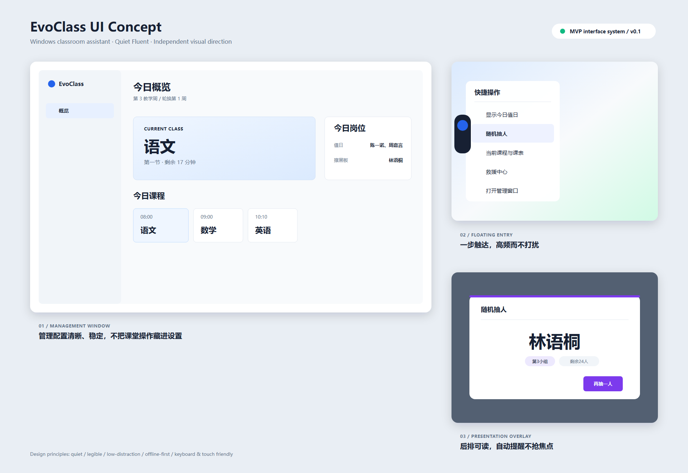
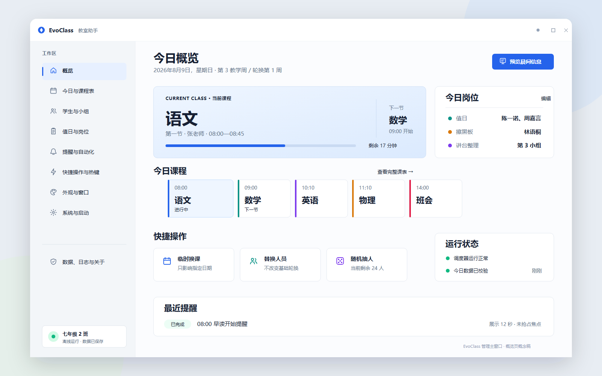
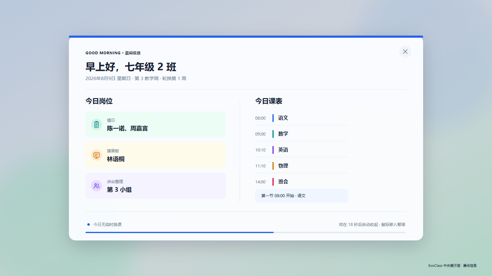
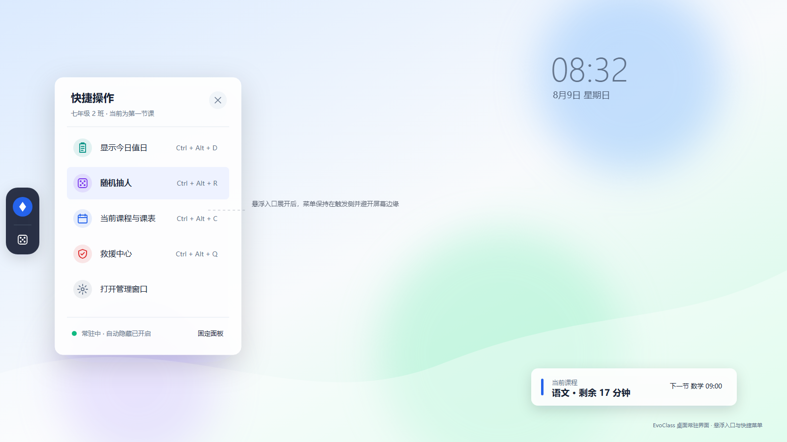
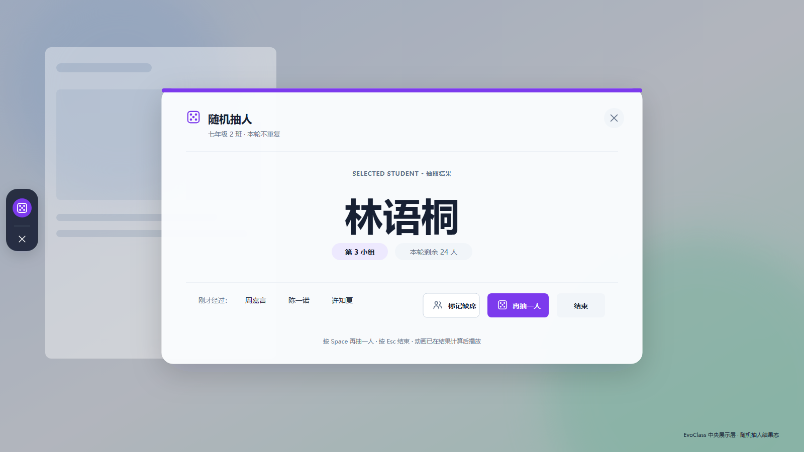

# EvoClass

面向中小学教室多媒体电脑的离线优先 Windows 桌面课堂信息助手。

EvoClass 计划通过常驻悬浮入口、中央展示层与独立管理窗口，为课堂提供课程表、值日与擦黑板安排、课间提醒、随机抽人、全局快捷键和受控窗口关闭等能力。项目坚持低干扰、本地可用、配置与展示分离，并采用独立设计与独立实现。

> [!NOTE]
> 项目目前处于产品与技术设计阶段，尚未发布可安装版本。

## 界面概念



| 管理概览 | 晨间信息 |
| --- | --- |
|  |  |

| 悬浮快捷面板 | 随机抽人 |
| --- | --- |
|  |  |

## 核心能力

- 单周、单双周及多周轮换课程表
- 值日生、擦黑板等自定义岗位轮换
- 日期级临时换课与人员替换
- 晨间信息、课前/课间/放学提醒
- 悬浮入口、快捷菜单与中央展示层
- 随机抽人和全局快捷键
- 系统托盘、单实例与可选开机启动
- 本地备份、导入与导出
- 受控的前台窗口关闭与救援操作

## 技术方向

| 类别 | 方案 |
| --- | --- |
| 目标平台 | Windows 10 / Windows 11 |
| 应用框架 | C#、WPF、WPF-UI |
| 目标运行时 | .NET 10 LTS |
| 架构 | MVVM、分层架构、领域事件 |
| 本地存储 | SQLite |
| 产品原则 | 离线优先、低干扰、数据可恢复 |

## 当前进度

- [x] 产品定位与范围定义
- [x] 核心流程与领域模型设计
- [x] 技术架构与 Windows 集成设计
- [x] 测试、发布与迭代计划
- [ ] Sprint 0：解决方案骨架与技术验证
- [ ] MVP 功能开发
- [ ] 安装包与首个预览版本

完整的产品需求、架构方案、数据模型、验收标准和迭代计划请参阅：

- [EvoClass 产品技术规格书](./EvoClass-%E4%BA%A7%E5%93%81%E6%8A%80%E6%9C%AF%E8%A7%84%E6%A0%BC%E4%B9%A6.md)
- [EvoClass 详细技术设计规范](./EvoClass-%E8%AF%A6%E7%BB%86%E6%8A%80%E6%9C%AF%E8%AE%BE%E8%AE%A1%E8%A7%84%E8%8C%83.md)
- [EvoClass 界面设计说明](./EvoClass-%E7%95%8C%E9%9D%A2%E8%AE%BE%E8%AE%A1%E8%AF%B4%E6%98%8E.md)

界面原型的 PNG 与 SVG 源文件位于 [`design/ui`](./design/ui)，生成脚本位于 [`tools/generate_ui_mockups.py`](./tools/generate_ui_mockups.py)。

## 计划中的解决方案结构

```text
src/
├── EvoClass.App/              # WPF 应用与组合根
├── EvoClass.Application/      # 用例、命令、查询和应用服务
├── EvoClass.Domain/           # 领域模型与规则
├── EvoClass.Infrastructure/   # SQLite、备份与系统集成
└── EvoClass.Presentation/     # 页面、视图模型与展示组件
tests/
├── EvoClass.Domain.Tests/
├── EvoClass.Application.Tests/
└── EvoClass.IntegrationTests/
```

## 开发准备

正式代码尚未初始化。开始 Sprint 0 时建议准备：

- Windows 10 22H2 或 Windows 11
- Visual Studio 2022（含 .NET 桌面开发工作负载）
- .NET 10 SDK
- Git

## 路线图

1. **0.1 / MVP**：档案、课程表、岗位轮换、课堂展示、提醒、快捷键、救援和备份。
2. **0.2**：自动化编辑器、课表导入、多档案、主题、Windows 本地 TTS 与自动更新。
3. **1.0+**：局域网集控、权限体系、插件 SDK 和可选云能力。

## 参与项目

欢迎通过 Issue 提交需求建议、交互反馈和兼容性信息。提交代码前请阅读 [贡献指南](./CONTRIBUTING.md)。

## 许可状态

本仓库目前尚未声明开源许可证。在许可证确定前，默认保留全部权利。EvoClass 不复制 ClassIsland 的源码、名称、图标、素材或界面细节。
